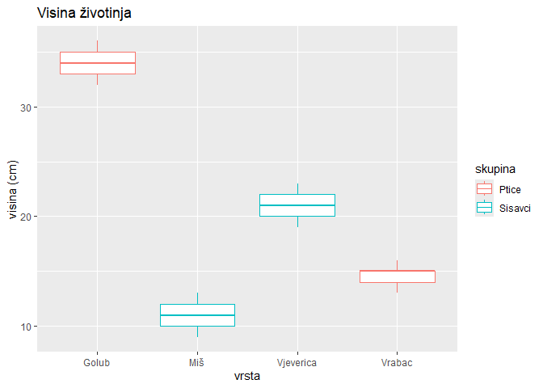

Uvod u R i RStudio
================
dr. sc. Lucija Kanjer, e-mail: <lucija.kanjer@biol.pmf.hr>
2025/26

## Anketa upoznavanja

- Otvorite poveznicu: <https://forms.office.com/e/FPkBKCs02J> ili
  **skenirajte QR kod**
- prijavite se sa svojim AAIEDU identitetom
- ispunite kratku anketu


## Teme praktikuma

- Uvod i unos podataka u R
- Rad s podacima
- Grafički prikazi
- Razdiobe i deskriptivna statistika
- Parametrijska statistika
- Neparametrijska staistika
- Statistika kategoričkih podataka
- Multivarijatna statistika

## Sadržaj današnje vježbe

- Upoznavanje s RStudio sučeljem
- Izvršavanje naredbi iz skripte
- definiranje i ispis objekata
- pisanje komentara
- osnovne matematičke operacije
- postavljanje radnog direktorija
- traženje pomoći
- instalacija i učitavanje paketa
- primjer izrade grafičkog prikaza

## Ishodi učenja praktikuma

- Upoznati se s R okruženejm
- Premostiti strah od „programiranja”
- Proći „energiju aktivacije” koja je potrebna za korištenje R-a i rada
  na vlastitim podacima i projektima
- Moći izraditi vlastite analize pomoću svih danas dostupnih alata

### Što nije ishod ovog praktikuma?

- Sveobuhvatno znanje o R-u
- Sveobuhvatno znanje o svim statističkim metodama
- Tečaj programiranja
- Učenje napamet naredbi R-a

## Prednosti R-a

1.  Besplatan softver otvorenog koda.

2.  Velika zajednica korisnika i podrška.

3.  Prilagođen akademskoj zajednici (i biolozima).

4.  Fleksibilnost i prilagodljivost - veliki broj paketa za
    specijalizirane analize.

5.  Napredne statističke i analitičke metode.

6.  Vizualizacija podataka.

7.  Reproducibilnost.

## Mane R-a u odnosu na *point and click* programe

- Strma krivulja učenja.
- Manje intuitivno sučelje.


## Što nam treba za rad?

**R** - statistički programski jezik


**RStudio** - multifunkcionalno sučelje za rad s programskim jezikom R,
engl. *integrated development environment* (IDE), mogu se koristiti i
drugi programi kao što su VS Code ili Positron


## Instalacija R-a

R se može preuzeti sa CRAN-a (Comprehensive R archive network)
<https://cran.r-project.org/>


## Instalacija RStudio-a

RStudio je dostupan za preuzimanje na Posit web stranici:

- <https://posit.co/download/rstudio-desktop/>


## RStudio - sučelje


## RStudio - sučelje

- Panel A: **Skripta** - dio u koji pišemo naredbe i komentare koje
  možemo izvršavati i spremiti za ponovnu upotrebu.
- Panel B: **Konzola** (engl. console) - dio u kojemo se naredbe
  izvršavaju (interaktivno okruženje), ali se ne može spremiti za
  ponovnu upotrebu; također i dio za terminal, render i pozadinske
  poslove.
- Panel C: Okoliš (engl. **environment**) - dio u kojem vidimo stvorene
  R objekte; također i dio za povijest, veze; git sinkronizaciju i
  tutoriale.
- Panel D: **plots** - dio za vizualizaciju grafova; **packages** - dio
  za vizualizaciju i učitavanje dostupnih paketa; **help** - u kojem se
  prikažu tražene informacije o paketima i naredbama; **files** -
  vizualizacija trenutnog radnog direktorija (nije za postavljanje novog
  radnog direktorije).

## Rad u R-u i RStudio-u

- Otvorite RStudio i krenimo s prvim naredbama!
- Izvršavanje naredbi: **Ctrl + Enter** u skripti.

``` r
# Prva naredba: ispis teksta iz skripte u konzolu
print("Hello world!")
```

    ## [1] "Hello world!"

## Komentari

- Sve što se piše iza znaka “**\#**” u skripti, predstavlja **komentar**
  i neće biti izvršeno kao naredba.
- Komentari se pišu u skripti kako bi naš kod bio pregledan i
  reproducibilan.

``` r
# Ovo je primjer komentara cijelog reda
print("Dobar dan svijete!") # ovo je komentar nakon naredbe
```

    ## [1] "Dobar dan svijete!"

## Definiranje varijabli

- Varijable su pojedinačne vrijednosti.
- U R-u, svaka varijabla može pohranjivati brojeve, tekstualne
  vrijednosti ili logičke vrijednosti.
- Definiraju se pomoći znakova “**\<-**” ili “=”

``` r
# Definiranje objekata (varijabli)
a <- 5
b = 3
ime <- "Lucija"
```

- prvi način je mnogo češće korišten u praksi jer se znak “=” koristi za
  i u druge svrhe

## Ispis

Ispis tj. prikaz R objekata, može se izvršiti na više načina:

``` r
# Različiti načina ispisa
print(a) # ispis u konzoli
```

    ## [1] 5

``` r
a # ispis u konzoli
```

    ## [1] 5

``` r
print(a + b) # ispis rezultata u konzoli
```

    ## [1] 8

``` r
cat("Ja sam", ime) # ispis više objekata i karaktera odjednom
```

    ## Ja sam Lucija

## Razlika između <code>cat()</code> i <code>print()</code>

Razlike između <code>print()</code> i <code>cat()</code> naredbi u R-u
nalaze se u načinu na koji prikazuju izlaz i koriste se za različite
svrhe:

- <code>print()</code> se koristi za ispisivanje objekata (vektora,
  matrica, data frameova itd.) u R-u. Ovo je najčešća funkcija za ispis
  rezultata.
- <code>cat()</code> se koristi za konkatenaciju (spajanje) i ispis
  teksta. Idealan je za ispisivanje nizova karaktera i jednostavnih
  poruka.

## Zadatak

Napravite varijablu “visina” te u nju spremite vrijednost svoje visine,
te varijablu “godina” te u nju spremite vrijednost svoje godine rođenja.
Ispišite svaku varijablu na različiti način.

``` r
# Primjer: Definirajmo varijablu svoje visine i godine rođenja
visina  <- 170
godina <- 1995
# Ispišimo ove varijable!
print(visina)
```

    ## [1] 170

``` r
cat("Ovo je moja godina:", godina)
```

    ## Ovo je moja godina: 1995

## Rad s osnovnim matematičkim operacijama

``` r
# Zbroj
zbroj <- 5 + 3
print(zbroj)
```

    ## [1] 8

``` r
# Umnožak
umnožak <- 4 * 7
print(umnožak)
```

    ## [1] 28

## Zadatak

Na isti način kao za zbroj i umnožak izračunajmo i ispišimo rezultate
oduzimanja(razliku) i dijeljenja brojeva (kvocijent).

## Razlika i kvocijent

``` r
# Razlika
razlika <- 10 -4
print(razlika)
```

    ## [1] 6

``` r
# Kvocijent
kvocijent <- 38 / 7
print(kvocijent)
```

    ## [1] 5.428571

## Ručni unos objekata u R-u

### Varijable

``` r
### Kreiranje objekata u R-u - ručni unos
# 1. Varijable
x <- 3.14         # numeric - brojčana vrijednost
y <- "DNA"        # character - tekst (mora ići u navodnike)
z <- TRUE         # logical - logička vrijednost (TRUE/FALSE)
```

## Provjera tipa i struktire podataka

``` r
# Provjera tipa podataka
class(x) # prikazuje samo tip varijable
```

    ## [1] "numeric"

``` r
str(x) # struktura: prikazuje tip varijable i što ona sadrži
```

    ##  num 3.14

## Provjerite tip podataka varijabli y i z!

``` r
# Provjerite tip podataka varijabli y i z!
class(y)
```

    ## [1] "character"

``` r
class(z)
```

    ## [1] "logical"

## Vektori

Vektor je niz elemenata iste vrste (npr. svi brojevi ili svi tekstovi).

``` r
# 2. Vektori
geni <- c("BRCA1", "TP53", "MYC")  # tekstualni vektor gena
print(geni)
```

    ## [1] "BRCA1" "TP53"  "MYC"

``` r
duljine <- c(1863, 1179, 1584)     # numerički vektor duljina gena u parovima baza (bp)
print(duljine)
```

    ## [1] 1863 1179 1584

## Matrice

Matrica je 2D struktura podataka iste vrste (redovi x stupci).

``` r
# 3. Matrice - skup vektora istog tipa
# Definiranje matrice
matrix_mikrobi <- matrix(c(85, 47, 37, 10, 65, 50, 28, 8), 
                         nrow = 4, # postavljanje broja redaka u matrici
                         byrow = TRUE) # definiranje popunjavanja matrice po retcima

# Dodavanje naziva redaka i stupaca
rownames(matrix_mikrobi) <- c("Bakterija1", "Bakterija2", "Gljivica1", "Gljivica2")
colnames(matrix_mikrobi) <- c("CFU_kuhinja", "CFU_kupaonica")
```

------------------------------------------------------------------------

``` r
print(matrix_mikrobi)
```

    ##            CFU_kuhinja CFU_kupaonica
    ## Bakterija1          85            47
    ## Bakterija2          37            10
    ## Gljivica1           65            50
    ## Gljivica2           28             8

## Podatkovni okvir (*data frame*)

Data frame je struktura podataka koja može sadržavati vektore varijabli
raličitih vrsta (brojevi, tekst, logičke vrijednosti).

``` r
# 4. Podatkovni okvir (data frame) - skup vektora različitih tipova
df_mikrobi <- data.frame(
  CFU = c(85, 47, 37, 10, 65, 50, 28, 8), # numeručki vektor
  mikrorganizam = c("Bakterija", "Bakterija", "Gljivica", "Gljivica"),  # tekstualni vektor 
  lokacija = c("kuhinja", "kupaonica", "kuhinja", "kupaonica") # tekstualni vektor
  )
```

------------------------------------------------------------------------

``` r
# Uvid u data frame
print(df_mikrobi) # ispis u konzoli
```

    ##   CFU mikrorganizam  lokacija
    ## 1  85     Bakterija   kuhinja
    ## 2  47     Bakterija kupaonica
    ## 3  37      Gljivica   kuhinja
    ## 4  10      Gljivica kupaonica
    ## 5  65     Bakterija   kuhinja
    ## 6  50     Bakterija kupaonica
    ## 7  28      Gljivica   kuhinja
    ## 8   8      Gljivica kupaonica

------------------------------------------------------------------------

``` rdf3
View(df_mikrobi) # vizualizacija tablice u novom listu
```


## Rad s datotakama

Radni direktorij, engl. **working directory**

``` r
# Provjeravanje radnog direktorija (working directory)
getwd()
```

    ## [1] "C:/Users/lucij/Documents/APUBI/01_Uvod"

``` r
# Postavljanje radnog direktorija

setwd("C:/Users/lucij/Documents/APUBI/01_Uvod/zivotinje") # moj laptop
#setwd("C:/Users/Hrvoje/Documents/APUBI/01_Uvod/zivotinje") # poslovno računalo

# Iznad je još jedan primjer korištenja komentara: 
# za naredbe koje ne želimo da se trenutno izvršavaju.
```

## Postavljanje radnog direktorija

- alternativni način postavljanja radnog direktorija klikanjem
- *Files* -\> ući u mapu koju želimo postaviti kao radni direktorij -\>
  *More* -\> *Set As Working Directory*


## Traženje pomoći

- <code>help(setwd)</code>
- <code>?setwd</code>
- <code>??setwd</code>

## Učitavanje datoteke s podacima

``` r
# Učitavanje datoteke s podacima u objekt "zivotinje"
zivotinje <- read.table("C:/Users/lucij/Documents/APUBI/01_Uvod/zivotinje/zivotinje.txt", 
                        header = TRUE)
```

## Kako pogledati svoje podatke?

``` r
print(zivotinje) # ispis cijele tablice u konzoli
```

    ##    uzorak     vrsta visina_cm masa_g skupina
    ## 1       1       Miš        10     25 Sisavci
    ## 2       2       Miš        12     30 Sisavci
    ## 3       3       Miš         9     22 Sisavci
    ## 4       4       Miš        11     28 Sisavci
    ## 5       5       Miš        13     35 Sisavci
    ## 6       6     Golub        35    300   Ptice
    ## 7       7     Golub        32    280   Ptice
    ## 8       8     Golub        36    320   Ptice
    ## 9       9     Golub        34    310   Ptice
    ## 10     10     Golub        33    290   Ptice
    ## 11     11    Vrabac        15     24   Ptice
    ## 12     12    Vrabac        14     22   Ptice
    ## 13     13    Vrabac        16     26   Ptice
    ## 14     14    Vrabac        15     23   Ptice
    ## 15     15    Vrabac        13     21   Ptice
    ## 16     16 Vjeverica        20    400 Sisavci
    ## 17     17 Vjeverica        22    420 Sisavci
    ## 18     18 Vjeverica        21    410 Sisavci
    ## 19     19 Vjeverica        19    380 Sisavci
    ## 20     20 Vjeverica        23    430 Sisavci

------------------------------------------------------------------------

``` r
# Vizualizacija podataka - kratki oblik
head(zivotinje) # prikaz "glave" tablice
```

    ##   uzorak vrsta visina_cm masa_g skupina
    ## 1      1   Miš        10     25 Sisavci
    ## 2      2   Miš        12     30 Sisavci
    ## 3      3   Miš         9     22 Sisavci
    ## 4      4   Miš        11     28 Sisavci
    ## 5      5   Miš        13     35 Sisavci
    ## 6      6 Golub        35    300   Ptice

------------------------------------------------------------------------

``` r
View(zivotinje) # prikaz u novom tabu pored skripte
```


## Paketi

- Instalacijom dodatnih paketa moguće je prilagoditi svoje analize, a
  izbora je stvarno puno!
- Npr. Za vizualizaciju podataka najčešće se korsiti dodatni paket
  **ggplot2** koji nije uključen u temeljni R (*base R*) te ga je
  potrebno instalirati.
- Instalacija paketa izvršava se samo jednom, a učitavanje paketa mora
  se izvršiti prilikom svakog otvaranja RStudio-a, tj. početkom svake
  nove sesije.

## Paketi

``` r
# Za dodatne analize moramo instalirati dodatne R pakete
# Instalacija paketa - samo jednom
```

<code>install.packages(“ggplot2”)</code>

``` r
# Učitavanje paketa u radno okruženje - pri svakom pokretanju R-a
library(ggplot2)
```

## Primjer izrade grafa

``` r
# izrada objekta "graf_visina"
graf_visina <- ggplot(data = zivotinje, aes(x = vrsta, y = visina_cm)) +
  geom_boxplot(aes(color = skupina)) + 
  labs(title = "Visina životinja",
       x = "vrsta",
       y = "visina (cm)")
```

------------------------------------------------------------------------

``` r
# ispis objekta "graf_visina"
graf_visina
```

<!-- -->

## Izmjenite gornji graf tako da se umjesto visine prikazuju podaci za masu!

Pazite da izmjenitie naslov grafa i nazive osi da odgovaraju novom
prikazu.

``` r
# izrada objekta "graf_masa"
graf_masa <- ggplot(data = zivotinje, aes(x = vrsta, y = masa_g)) +
  geom_boxplot(aes(color = skupina)) + 
  labs(title = "Masa životinja",
       x = "vrsta",
       y = "masa (g)")
```

## Dodatni izvori

How To R: Getting Started with R and RStudio

<https://www.youtube.com/watch?v=lVKMsaWju8w>


## Samostalni zadaci

1.  Kreirajte 3 varijable za visine 3 različite životinje.
2.  Izračunajte i ispišite umnožak visine životinja koje ste upisali.
3.  Napravite novu mapu naziva “biljke” te ju postavite kao novi radni
    direktorij.
4.  Kreirajte 2 varijable, u jednu spremite ime vrste po vašem izboru, a
    u drugu broj jedinki te vrste.
5.  Ispištie tip objekta za novokreirane varijable.
6.  Kreirajte 2 vektora, u jednom pohranite tekstove, a u drugom
    brojeve.
7.  Kreirajte data frame s biološkim podacima po vašem izboru, mora
    sadržavati 2 numeričke i 2 kategoričke varijable.
8.  Ispišite strukturu novokreiranog data frame-a.

## Kviz

Otvorite poveznicu: <https://forms.office.com/e/cG5bh8WvPk>

ili **skenirajte QR kod** i ispunite kratki kviz danas naučenoga!


