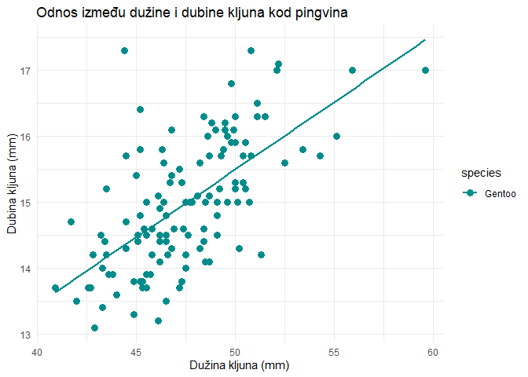

Grafički prikaz podataka u R-u
================
Lucija Kanjer
2025/26

## Sadržaj današnje vježbe

- base R naredbe za osnovne grafove
- ggplot2 slojevi i estetika

## Različiti načini grafičkih prikaza - base R vs. ggplot2

### Base R plotovi

- nije potrebna instalacija ni učitavanje dodatnih paketa
- jednostavne funkcije
- najčešće korišteno za brzinsku provjeru izgleda podataka i rezultata
  statistike
- slabija i kompliciranija mogućnost prilagodbe grafa

### ggplot2 grafovi

- potrebno instalirati i učitati paket ggplot2
- vrlo fleksibilan za prilagodbu
- dio tidyverse skupa paketa koji su prilagođeni za manipulaciju
  podacima
- mnogi statistički paketi kompatibilni s ggplot2
- najčešće korišten za izradu finalnog grafa za publikacije

## Učitavanje paketa

``` r
library(ggplot2) # paket za crtanje grafova
library(dplyr) # paket za manipulaciju tablicama
```

    ## 
    ## Attaching package: 'dplyr'

    ## The following objects are masked from 'package:stats':
    ## 
    ##     filter, lag

    ## The following objects are masked from 'package:base':
    ## 
    ##     intersect, setdiff, setequal, union

## Učitavanje podataka o pingvinima

- Podaci o pingvinima arhipelaga Palmer sadrže mjerenja veličine za
  **tri vrste pingvina** (Adelie, Chinstrap i Gentoo) promatrane na
  **tri otoka** (Torgersen, Dream, Biscoe) u arhipelagu Palmer na
  Antarktici.
- Ove je podatke prikupila dr. Kristen Gorman u sklopu dugoročnih
  američkih ekoloških istraživanja stanice Palmer. Podaci su uvezeni
  izravno s podatkovnog portala Inicijative za podatke o okolišu
  ( Environmental Data Initiative - EDI) i dostupni su za korištenje uz
  CC0 licencu (“Bez pridržanih prava”) u skladu s Politikom podataka
  Palmer Station.

Više o paketu palmerpenguins:
<https://allisonhorst.github.io/palmerpenguins/>

``` r
# Učitavanje seta podataka o pingvinima
library(palmerpenguins)
```

    ## 
    ## Attaching package: 'palmerpenguins'

    ## The following objects are masked from 'package:datasets':
    ## 
    ##     penguins, penguins_raw

``` r
penguins <- penguins
```

## Primjer 1: Histogram

``` r
# Base R histogram
hist(penguins$body_mass_g,
     main = "Distribucija mase tijela pingvina (Base R)",
     xlab = "Masa tijela (g)",
     col = "lightblue",
     border = "black")
```

<!-- -->

## Koju grešku uočavate na prikazu ovog grafa?

Probajte na internetu naći rješenje kako to ispraviti!

## 

``` r
# Proširivanje vrijednosti x i y osi
hist(penguins$body_mass_g,
     main = "Distribucija mase tijela pingvina (Base R)",
     xlab = "Masa tijela (g)",
     col = "lightblue",
     border = "black",
     xlim = c(2000, 7000), ylim = c(0, 100))
```

<!-- -->

## Izrada histograma pomoću ggplota

``` r
# ggplot2 histogram
ggplot(penguins, aes(x = body_mass_g)) +
  geom_histogram(binwidth = 500, fill = "lightblue", color = "black") +
  labs(title = "Distribucija mase tijela pingvina (ggplot2)", 
       x = "Masa tijela (g)")
```


## Primjer 2: Stupičasti dijagram (*bar plot*)

``` r
# Primjer 2: Stupičasti dijagram (bar plot)

# Prvo: Kreiranje tablice za broj pingvina po vrsti
species_count <- table(penguins$species)
print(species_count)
```

    ## 
    ##    Adelie Chinstrap    Gentoo 
    ##       152        68       124

## 

``` r
# Drugo: izrada stupičastog dijagrama
# Base R barplot
barplot(species_count,
        main = "Distribucija pingvina po vrsti",
        xlab = "Vrsta",
        ylab = "Broj pingvina",
        col = "darkorange")
```

<!-- -->

## 

``` r
# ggplot2 barplot
ggplot(penguins, aes(x = species)) +
  geom_bar(fill = "darkorange") +
  labs(title = "Distribucija pingvina po vrsti (ggplot2)", 
       x = "Vrsta", 
       y = "Broj pingvina")
```

<!-- -->

## Primjer 3: Točkasti dijagram (*scatter plot*)

``` r
# Base R scatter plot
plot(penguins$bill_length_mm, penguins$bill_depth_mm,
     main = "Odnos dužine i dubine kljuna (Base R)",
     xlab = "Dužina kljuna (mm)",
     ylab = "Dubina kljuna (mm)",
     col = "darkgreen", pch = 19)
```

<!-- -->

## 

``` r
# ggplot2 scatter plot
ggplot(penguins, aes(x = bill_length_mm, y = bill_depth_mm)) +
  geom_point(color = "darkgreen", size = 2) +
  labs(title = "Odnos dužine i dubine kljuna (ggplot2)", 
       x = "Dužina kljuna (mm)", 
       y = "Dubina kljuna (mm)")
```

<!-- -->

## ggplot2 paket - slojevi i estetika

### Opis

- ggplot2 je jedan od najpopularnijih paketa za vizualizaciju podataka u
  R-u.
- Zasnovan je na *Grammar of Graphics*, što omogućava korisnicima da
  sloje grafičke elemente i prilagođavaju ih na različite načine.
- Fleksibilan je za stvaranje složenih grafika uz relativno jednostavan
  i intuitivan kod.

## Ključne karakteristike ggplot2 paketa

- Jednostavnost u izradi prilagođenih vizualizacija.
- Podržava različite tipove grafikona: histogrami, scatterplot-ovi,
  boxplot-ovi, line grafikoni i mnogi drugi.
- Omogućava kombiniranje više plotova u jedan prikaz.
- Visok stupanj prilagodbe: boje, naslovi, osi, oznake, veličina i drugi
  estetski elementi.

### 1. Osnovni graf bez slojeva

``` r
ggplot() # osnovna naredba
```

<!-- -->

### Osnovni grafikon - postavljamo estetiku, ali bez sloja

``` r
ggplot(data = penguins, aes(x = bill_length_mm, y = bill_depth_mm))
```

<!-- -->

### 2. Dodavanje prvog geometrijskog sloja: scatter plot

``` r
ggplot(data = penguins, aes(x = bill_length_mm, y = bill_depth_mm)) +
  geom_point()
```

<!-- -->

### 3. Dodavanje boje kao estetike i većih točaka

``` r
ggplot(data = penguins, aes(x = bill_length_mm, y = bill_depth_mm, color = species)) +
  geom_point(size = 3)
```

<!-- -->

### 4. Dodavanje trenda sa geom_smooth()

``` r
ggplot(data = penguins, aes(x = bill_length_mm, y = bill_depth_mm, color = species)) +
  geom_point(size = 3) +
  geom_smooth(method = "lm", se = FALSE)  # linearna regresija bez prikaza greške
```

    ## `geom_smooth()` using formula = 'y ~ x'

<!-- -->

### 5. Dodavanje naslova i oznaka osi sa slojem labs()

``` r
ggplot(data = penguins, aes(x = bill_length_mm, y = bill_depth_mm, color = species)) +
  geom_point(size = 3) +
  geom_smooth(method = "lm", se = FALSE) +
  labs(title = "Odnos između dužine i dubine kljuna kod pingvina",
       x = "Dužina kljuna (mm)", y = "Dubina kljuna (mm)")
```

    ## `geom_smooth()` using formula = 'y ~ x'

<!-- -->

### 6. Podešavanje tema sa slojem theme()

``` r
ggplot(data = penguins, aes(x = bill_length_mm, y = bill_depth_mm, color = species)) +
  geom_point(size = 3) +  
  geom_smooth(method = "lm", se = FALSE) +
  labs(title = "Odnos između dužine i dubine kljuna kod pingvina",
       x = "Dužina kljuna (mm)", y = "Dubina kljuna (mm)") +
  theme_minimal()  # Minimalna tema za čist izgled
```

    ## `geom_smooth()` using formula = 'y ~ x'

<!-- -->

### 7. Finalno prilagođavanje: promjena skale boja

``` r
ggplot(data = penguins, aes(x = bill_length_mm, y = bill_depth_mm, color = species, shape = species)) +
  geom_point(size = 3) +
  geom_smooth(method = "lm", se = FALSE) +
  labs(title = "Odnos između dužine i dubine kljuna kod pingvina",
       x = "Dužina kljuna (mm)", y = "Dubina kljuna (mm)") +
  scale_color_manual(values = c("Adelie" = "darkorange", "Chinstrap" = "purple", "Gentoo" = "cyan4")) +
  theme_minimal()
```

    ## `geom_smooth()` using formula = 'y ~ x'

<!-- -->

## Zadatak 1

- prisjetite se gradive prošle vježbe - manipulacija tablicom i
  napravite 3 grafa po uzoru na gornji
- svaki graf neka pokazuje odnos duljine i dubine kljuna za 1 vrstu!

### Rješenje

``` r
# Izrada tablice za svaku vrstu naredbom filter()
adelie <- filter(penguins, species == "Adelie")
chinstrap <- filter(penguins, species == "Chinstrap")
gentoo <- filter(penguins, species == "Gentoo")
```

``` r
# adelie graf
ggplot(data = adelie, aes(x = bill_length_mm, y = bill_depth_mm, color = species)) +
  geom_point(size = 3) +
  geom_smooth(method = "lm", se = FALSE) +
  labs(title = "Odnos između dužine i dubine kljuna kod pingvina",
       x = "Dužina kljuna (mm)", y = "Dubina kljuna (mm)") +
  scale_color_manual(values = c("Adelie" = "darkorange")) +
  theme_minimal()
```

    ## `geom_smooth()` using formula = 'y ~ x'

<!-- -->

``` r
# chinstrap graf
ggplot(data = chinstrap, aes(x = bill_length_mm, y = bill_depth_mm, color = species)) +
  geom_point(size = 3) +
  geom_smooth(method = "lm", se = FALSE) +
  labs(title = "Odnos između dužine i dubine kljuna kod pingvina",
       x = "Dužina kljuna (mm)", y = "Dubina kljuna (mm)") +
  scale_color_manual(values = c("Chinstrap" = "purple")) +
  theme_minimal()
```

    ## `geom_smooth()` using formula = 'y ~ x'

<!-- -->

``` r
# gentoo graf
ggplot(data = gentoo, aes(x = bill_length_mm, y = bill_depth_mm, color = species)) +
  geom_point(size = 3) +
  geom_smooth(method = "lm", se = FALSE) +
  labs(title = "Odnos između dužine i dubine kljuna kod pingvina",
       x = "Dužina kljuna (mm)", y = "Dubina kljuna (mm)") +
  scale_color_manual(values = c("Gentoo" = "cyan4")) +
  theme_minimal()
```

    ## `geom_smooth()` using formula = 'y ~ x'

<!-- -->

## Zadatak 2

- Nacrtajte grafove sa početka skripte (histogram, scatterplot, barplot
  i boxplot) pomoću ggplot2 paketa!
- Svaki neka ima različitu temu i boje na grafu!

Pomoćna pitanja za provjeru izrade dobrog grafa: - Je li graf čitljiv i
kontrastan? - Jesu li osi jasno označene i na hrvatskom jeziku? -
Pokazuje li boja informaciju ili samo dekoraciju?

### Rješenje

``` r
# 1. Histogram - prikaz distribucije tjelesne mase pingvina
ggplot(penguins, aes(x = body_mass_g)) +
  geom_histogram(binwidth = 300, fill = "skyblue", color = "black") +
  labs(title = "Distribucija tjelesne mase pingvina",
       x = "Masa tijela (g)",
       y = "Broj jedinki") +
  theme_minimal()
```

<!-- -->

``` r
# 2. Scatterplot - odnos dužine i dubine kljuna
ggplot(penguins, aes(x = bill_length_mm, y = bill_depth_mm, color = species)) +
  geom_point(size = 3, alpha = 0.8) +
  labs(title = "Odnos dužine i dubine kljuna kod pingvina",
       x = "Dužina kljuna (mm)",
       y = "Dubina kljuna (mm)") +
  theme_classic() +
  scale_color_manual(values = c("Adelie" = "steelblue",
                                "Chinstrap" = "darkred",
                                "Gentoo" = "darkgreen"))
```

<!-- -->

``` r
# 3. Barplot - broj pingvina po vrsti
ggplot(penguins, aes(x = species, fill = species)) +
  geom_bar(color = "black") +
  labs(title = "Broj pingvina po vrsti",
       x = "Vrsta pingvina",
       y = "Broj jedinki") +
  theme_light() +
  scale_fill_manual(values = c("Adelie" = "lightblue",
                               "Chinstrap" = "orange",
                               "Gentoo" = "lightgreen"))
```

<!-- -->

``` r
# 4. Boxplot - raspodjela tjelesne mase po spolu
ggplot(penguins, aes(x = sex, y = body_mass_g, fill = sex)) +
  geom_boxplot() +
  labs(title = "Raspodjela tjelesne mase po spolu pingvina",
       x = "Spol",
       y = "Masa tijela (g)") +
  theme_bw() +
  scale_fill_manual(values = c("female" = "pink", "male" = "lightblue"))
```

<!-- -->
