Grafički prikaz podataka u R-u (2)
================
Lucija Kanjer
2025/26

## Sadržaj današnje vježbe

Grafički prikazi po tipu varijabli

1.  kategoričke varijable
2.  numeričke varijable
3.  dvije kategoričke
4.  dvije numeričke
5.  odnos numeričke i kategoričke

### Učitavanje paketa

``` r
library(ggplot2) # paket za crtanje grafova
library(dplyr) # paket za manipulaciju tablicama
```

    ## 
    ## Attaching package: 'dplyr'

    ## The following objects are masked from 'package:stats':
    ## 
    ##     filter, lag

    ## The following objects are masked from 'package:base':
    ## 
    ##     intersect, setdiff, setequal, union

``` r
library(palmerpenguins) # paket o pingvinima
```

    ## 
    ## Attaching package: 'palmerpenguins'

    ## The following objects are masked from 'package:datasets':
    ## 
    ##     penguins, penguins_raw

### Učitavanje podataka o pingvinima

``` r
penguins <- penguins
head(penguins)
```

    ## # A tibble: 6 × 8
    ##   species island    bill_length_mm bill_depth_mm flipper_length_mm body_mass_g
    ##   <fct>   <fct>              <dbl>         <dbl>             <int>       <int>
    ## 1 Adelie  Torgersen           39.1          18.7               181        3750
    ## 2 Adelie  Torgersen           39.5          17.4               186        3800
    ## 3 Adelie  Torgersen           40.3          18                 195        3250
    ## 4 Adelie  Torgersen           NA            NA                  NA          NA
    ## 5 Adelie  Torgersen           36.7          19.3               193        3450
    ## 6 Adelie  Torgersen           39.3          20.6               190        3650
    ## # ℹ 2 more variables: sex <fct>, year <int>

## 1. Grafički prikazi kategoričkih varijabli

### 1.1 Barplot - za prikaz broja pingvina po vrstama

``` r
ggplot(penguins, aes(x = species)) + 
  geom_bar() + theme_minimal()
```

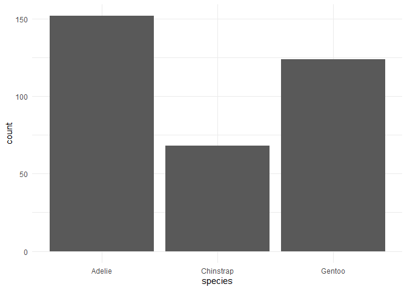<!-- -->

#### Kako prikazati kategorije vrste od najbrojnije do najmanje brojne?

Moramo pretvoriti kategoričku varijablu “species” u faktor!

- Faktori su poseban način zapisivanja kategoričkih varijbli u R-u.
- Funkcioniraju tako da vrijednosti zapišu u nivoe tj. levele i tako
  olakšavaju prikaz vrijednosti kategoričke varijable.

U ovom primjeru koristimo funkciju **<code>factor()</code>** kako bi
poredali varijablu “species” po silaznom (*decreasing*) poretku.

``` r
penguins$species <- factor(penguins$species, 
                           levels = names(sort(table(penguins$species), decreasing = TRUE)))
```

#### Ponovo crtamo barplot

``` r
ggplot(penguins, aes(x = species)) + 
  geom_bar() + theme_minimal()
```

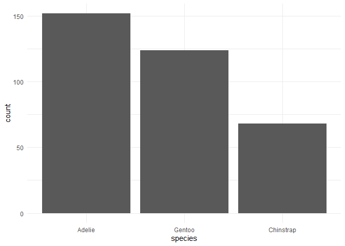<!-- -->

### (1.2 *Pie chart* za prikaz udjela pingvina po vrstama)

``` r
species_count <- table(penguins$species)

pie(species_count, main = "Udio pingvina po vrstama")
```

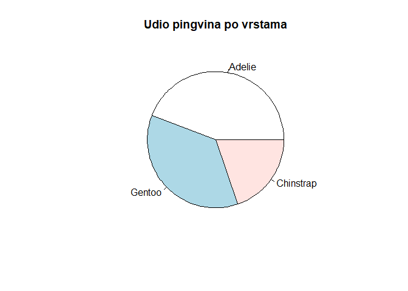<!-- -->

## 2. Grafički prikazi numeričkih varijabli

### 2.1 Histogram za prikaz distribucije mase tijela pingvina

``` r
ggplot(penguins, aes(x = body_mass_g)) +
  geom_histogram(binwidth = 100, color = "black", fill = "darkred") + 
  theme_minimal()
```

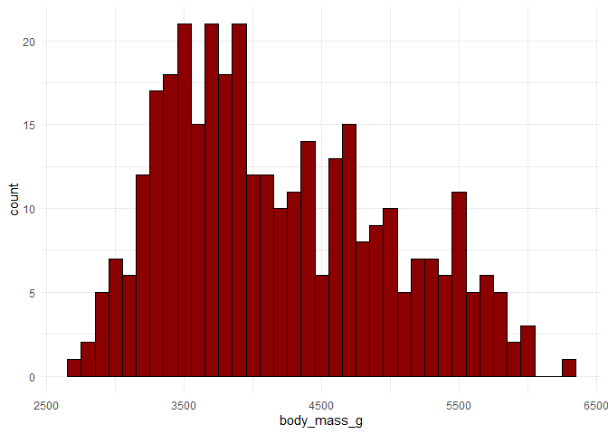<!-- -->

Poigrajte se s opcijom “binwidth”! Što se događa s grafom? Koja
vrijednost najbolje pokazuje distrubuciju?

- Zadatak: Napravite histogram za još jednu numeričku varijablu! Koja
  opcija binwidth je najbolja za tu varijablu?

## 3. Prikaz odnosa dvije kategoričke varijable

### 3.1 Stacked bar plot

``` r
ggplot(data = penguins, aes(x = species, fill = sex)) +
  geom_bar() +
  theme_minimal()
```

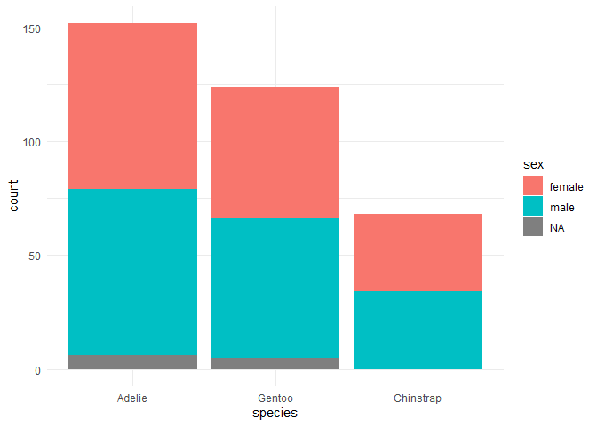<!-- -->

### 3.2 Bar plot - prikaz spola pingvina za svaku vrstu

``` r
ggplot(data = penguins, aes(x = species, fill = sex)) +
  geom_bar(position = "dodge") +
  theme_minimal()
```

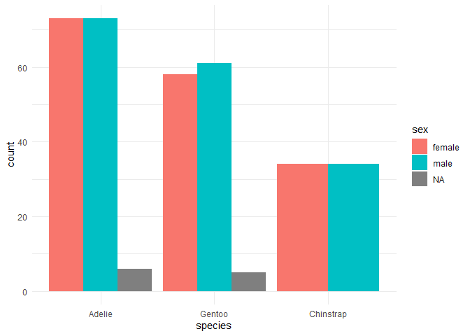<!-- -->

### 3.3 Relativni odnos

``` r
ggplot(data = penguins, aes(x = species, fill = sex)) +
  geom_bar(position = "fill") + 
  theme_minimal()
```

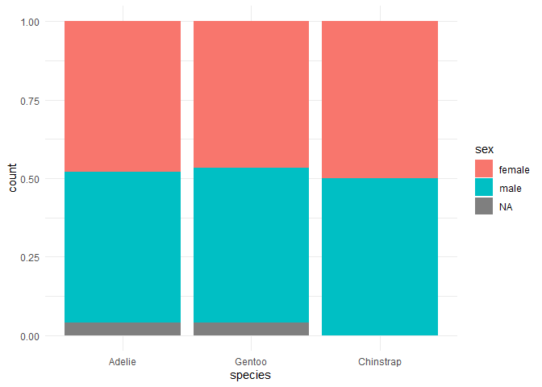<!-- -->

- Zadatak: Prisjetite se gradiva prošle vježbe i uklonite nedostajuće
  vrijednosti pa ponovite grafove!

``` r
ggplot(na.omit(penguins), aes(x = species, fill = sex)) +
  geom_bar() +
  theme_minimal()
```

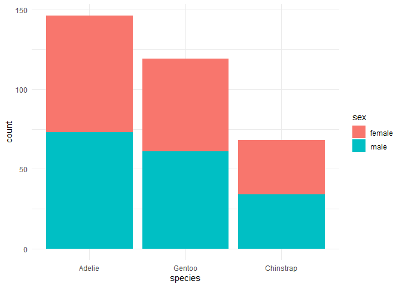<!-- -->

## 4. Prikaz odnosa dvije numeričke varijable

### 4.1 Točkaskti graf (scatter plot)

``` r
ggplot(data = penguins, aes(x = bill_length_mm, y = bill_depth_mm, color = species)) +
  geom_point() +
  theme_minimal()
```

<!-- -->

## 5. Prikaz odnosa numeričke i kategoričke varijable

### 5.1 Box plot - prikaz mase pingvina po vrstama

``` r
ggplot(data = penguins, aes(x = species, y = body_mass_g, fill = species)) +
  geom_boxplot() +
 theme_minimal()
```

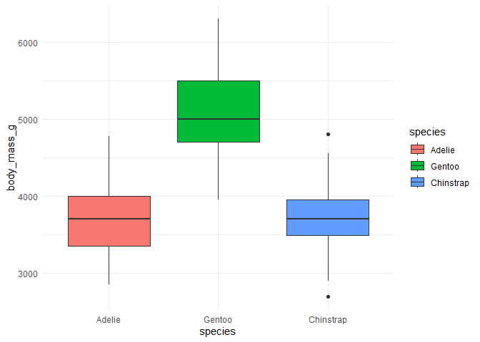<!-- -->

### 5.2 Strip chart

``` r
ggplot(data = penguins, aes(x = species, y = body_mass_g, color = species)) +
  geom_jitter() +
  theme_minimal()
```

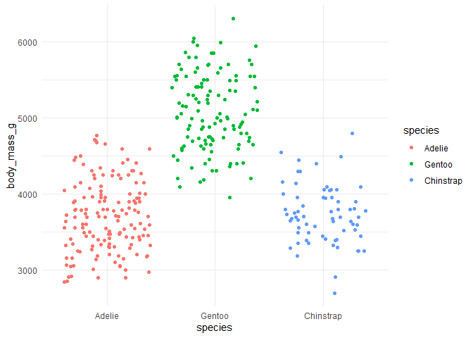<!-- -->

# Kombinacija boxplota i jittera

``` r
ggplot(data = penguins, aes(x = species, y = body_mass_g, fill = species)) +
  geom_boxplot() + geom_jitter() +
  theme_minimal()
```

<!-- -->

### 5.3 Violin plot

``` r
ggplot(data = penguins, aes(x = species, y = body_mass_g, fill = species)) +
  geom_violin() +
  theme_minimal()
```

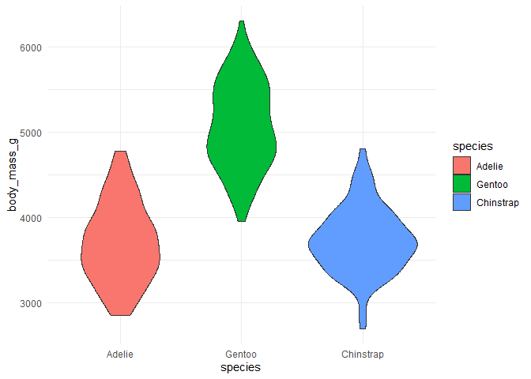<!-- -->

### 5.4 Višestruki histogrami

``` r
ggplot(data = penguins, aes(x = body_mass_g)) +
  geom_histogram(binwidth = 200, color = "black", fill = "lightblue") +
  facet_wrap( ~ species, ncol = 1, scales = "free_y", strip.position = "right") +
  theme_minimal()
```

<!-- -->

#### Zadatak: Napravite višestruki histogram za duljinu peraja!

### Spajanje više grafova u jedan - paket patchwork

``` r
#install.packages("patchwork")
library(patchwork)
```

##### Prvo spremamo grafove u objekte

``` r
barplot <- ggplot(penguins, aes(x = species, fill = species)) + 
  geom_bar() + 
  theme_minimal()

histogram <- ggplot(penguins, aes(x = body_mass_g)) +
  geom_histogram(binwidth = 300, color = "black", fill = "aquamarine") + 
  theme_minimal()
```

#### Ispis barplota i histograma jedan pored drugoga

``` r
barplot + histogram
```

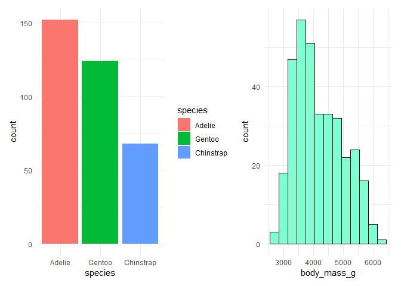<!-- -->

#### Zadatak: ispišite barplot i histogram jedan ispod drugoga!

``` r
barplot / histogram
```

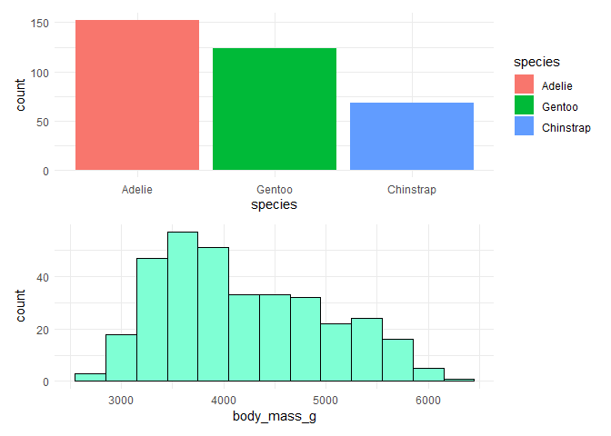<!-- -->

## Eksportiranje ggplot grafa kao slike ili PDF dokumenta

``` r
ggsave(filename = "histogram.jpg", # naziv JPG slike
       plot = histogram, # koji objekt želimo eksportirati
       width = 8, height = 6, # dimenzije u inčima
       dpi = 300) # dots per inch

ggsave(filename = "histogram.pdf", 
       plot = histogram,
       width = 8, height = 6, 
       device = cairo_pdf) # naziv metode eksporta za PDF
```

Gdje se spremila slika grafa? (u radni direktorij).

## Zadaci - odaberite i napravite prikladan tip grafa za svaku od slijedećih prikaza

1.  samo za Gentoo: prikaz razdiobe duljine peraja
2.  prikaz broja jedinki po otocima
3.  prikaz ovisnosti duljine peraja o masi pingvina, kategorije obojane
    po vrsti
4.  samo za Adelie vrstu: usporedba mase pingvina po spolu, s uklonjenim
    nedostajućim vrijedonstima te bojama ispune po spolu
5.  prikaz broja jedinki različitih vrsta pingvina po otocima

Pomoćna pitanja za provjeru izrade dobrog grafa: - Je li graf čitljiv i
kontrastan? - Jesu li osi jasno označene i na hrvatskom jeziku? -
Pokazuje li boja informaciju ili samo dekoraciju?

### Dodatni zadatci

1.  Eksportirajte grafove kao PNG slike.
2.  Instalirajte paket RColorBrewer i promjeniti palete boja na
    prijašnjim grafovima. Pazite da grafovi budu kontrasni i
    informativni.
