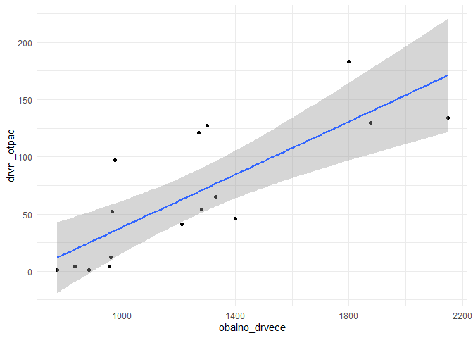
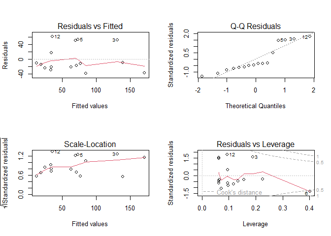
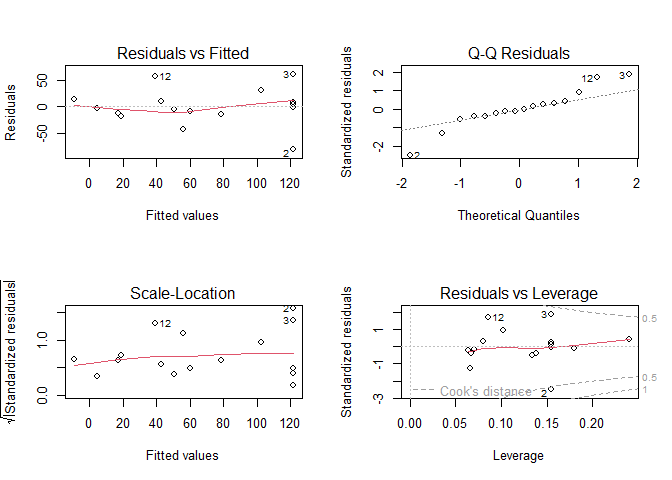

Linearna regresija u R-u
================
Lucija Kanjer
2025/26

## Priprema

``` r
# Učitajte potrebne pakete
library(ggplot2) # grafovi

# Postavljanje radnog direktorija
getwd()
```

    ## [1] "C:/Users/lucij/Documents/APUBI/07_Regresije"

``` r
setwd("C:/Users/lucij/Documents/APUBI/07_Regresije/")
```

------------------------------------------------------------------------

``` r
# Učitajte podatke iz CSV datoteke
# Podaci sadrže informacije o gustoći drveća, kabina i krupnom drvenom otpadu
jezera <- read.csv("christensen1996.csv")

# Pogledajte prvih nekoliko redaka podataka kako biste razumjeli strukturu
head(jezera)
```

    ##       jezero obalno_drvece drvni_otpad kolibe
    ## 1        Bay          1270         121    0.0
    ## 2    Bergner          1210          41    0.0
    ## 3   Crampton          1800         183    0.0
    ## 4       Long          1875         130    0.0
    ## 5      Roach          1300         127    0.0
    ## 6 Tenderfoot          2150         134    0.6

## Dataset o jezerima

- primjer sa predavanja na linku:
  <https://mjkeough.github.io/examples/christ.nb.html>
- iz rada:
  <https://esajournals.onlinelibrary.wiley.com/doi/10.2307/2269598>

Varijable:

- jezero - 16 jezera u Sjevernoj Americi
- obalno_drvece - gustoća obalnog drveća po kilometru (km−1)
- drvni_otpad - površina drvnog otpada u m2 po kilometru (m2 km−1)
- kolibe - gustoća ljudskih koliba po kilometru (no. km−1)

## *“Coarse woody debris is important littoral habitat for many aquatic organisms”*

Pitanja

- Kako gustoća obalnog drveća utječe na količinu drvnog otpada?
- Kako gustoća ljudskih koliba utječe na količinu drvnog otpada?

## Vizualizacija podataka

``` r
# Scatter plot odnosa drvnog otpada i gustoće obalnog drveća
ggplot(jezera, aes(x = obalno_drvece, y = drvni_otpad)) + geom_point() +                                      geom_smooth(method = "lm") + theme_minimal()
```

<!-- -->

------------------------------------------------------------------------

``` r
# Linearna regresija

# nezavisna varijabla: obalno_drvece
# zavisna varijabla: drvni_otpad

# Linearni Model: Utjecaj gustoće obalnog drveća na količinu drvnog otpada
model_drvece <- lm(drvni_otpad ~ obalno_drvece, data = jezera)
```

## 

``` r
# Ispis sažetka modela za interpretaciju koeficijenata
summary(model_drvece)
```

    ## 
    ## Call:
    ## lm(formula = drvni_otpad ~ obalno_drvece, data = jezera)
    ## 
    ## Residuals:
    ##    Min     1Q Median     3Q    Max 
    ## -38.62 -22.41 -13.33  26.16  61.35 
    ## 
    ## Coefficients:
    ##                Estimate Std. Error t value Pr(>|t|)    
    ## (Intercept)   -77.09908   30.60801  -2.519 0.024552 *  
    ## obalno_drvece   0.11552    0.02343   4.930 0.000222 ***
    ## ---
    ## Signif. codes:  0 '***' 0.001 '**' 0.01 '*' 0.05 '.' 0.1 ' ' 1
    ## 
    ## Residual standard error: 36.32 on 14 degrees of freedom
    ## Multiple R-squared:  0.6345, Adjusted R-squared:  0.6084 
    ## F-statistic:  24.3 on 1 and 14 DF,  p-value: 0.0002216

## Interpretacija rezultata modela

**Residuals (reziduali):**

- Razlike između stvarnih vrijednosti zavisne varijable (drvni_otpad) i
  predikcija modela. Najniža greška je -38.62. Najveća greška je 61.35.
  1Q i 3Q: Kvartili pokazuju interkvartilnu raspodjelu grešaka između
  -22.41 i 26.16.

Koeficijenti modela:

- **Intercept (Presjek):** −77.09908; Kada nema obalnog drveća
  (obalno_drvece=0), predviđa se da je drvni otpad -77.09908 (nije
  fizički smislen rezultat, ali je dio modela). P-vrijednost: 0.024552
  (značajno na nivou p \< 0.05, označeno sa \*).

- **obalno_drvece:** 0.11552; Svako povećanje za 1 jedinicu u
  obalno_drvece povezano je s prosječnim povećanjem od 0.11552 u
  drvni_otpad. P-vrijednost: 0.000222

Značajnost modela:

- **R2** = 0.6345; Oko 63.45% varijacije u zavisnoj varijabli
  (drvni_otpad) može se objasniti nezavisnom varijablom (obalno_drvece).
- **Adjusted R2** = 0.6084 korigira R2 za broj prediktora, što je
  relevantno kod više varijabli.
- **F-statistika** = 24.3 s p-vrijednosti = 0.0002216

## Zaključak modela <code>model_drvece</code>

Model pokazuje:

- Značajnu pozitivnu vezu između obalno_drvece i drvni_otpad.
- Iako model ima određenu prediktivnu moć (R2) postoje varijacije koje
  nisu objašnjene, što sugerira mogućnost uvođenja dodatnih varijabli
  ili poboljšanja modela.

Napomena:

- Rezidualni standardni error (36.32) označava prosječnu grešku
  predikcije modela, treba provjeriti da li su pretpostavke linearne
  regresije zadovoljene (npr. normalnost reziduala, homoscedastičnost -
  varijanca je konstantna).

## Grafička dijagnostika modela <code>model_drvece</code>

``` r
par(mfrow = c(2, 2))
plot(model_drvece)
```

<!-- -->

## Grafička dijagnostika modela

1.  **Residuals vs. fitted** - provjera konstantne varijance reziduala:
    točke bi trebale biti jednakomjerno raspršene oko nule.

2.  **Q-Q Residuals** - provjera normalnosti reziduala: točke bi trebali
    slijediti pravac, odstupanja ukazuju na ne-normalnu raspodjelu.

3.  **Scale-Location** - slično prvom plotu, ali napredna provjera
    varijance reziduala.

4.  **Residuals vs. Leverage** - identifikacija utjecajnih točaka. Točke
    s visokom leverage vrijednošću (udaljenost od prosjeka nezavisnih
    varijabli) i visokim rezidualima mogu imati snažan utjecaj na model.

## Dodatno - sume kvadrata i stupnjevi slobode

``` r
anova(model_drvece)
```

    ## Analysis of Variance Table
    ## 
    ## Response: drvni_otpad
    ##               Df Sum Sq Mean Sq F value    Pr(>F)    
    ## obalno_drvece  1  32054   32054  24.303 0.0002216 ***
    ## Residuals     14  18466    1319                      
    ## ---
    ## Signif. codes:  0 '***' 0.001 '**' 0.01 '*' 0.05 '.' 0.1 ' ' 1

## Predikcija modela

- Naredba predict() koristi model za predviđanje vrijednosti zavisne
  varijable (drvni_otpad) na osnovu novih vrijednosti nezavisne
  varijable (obalno_drvece).
- interval = “confidence”- tražimo interval povjerenja za predviđanje
  (npr. 95% CI je zadano). Interval povjerenja ukazuje na interval u
  kojem očekujemo prosječnu vrijednost zavisne varijable za danu
  vrijednost prediktora (u ovom slučaju 1500)

``` r
predict(model_drvece, data.frame(obalno_drvece = c(1500)), 
        interval = "confidence")
```

    ##        fit      lwr    upr
    ## 1 96.17503 72.93007 119.42

- **Rezultat**: predviđamo koliko bi bilo otpada ako ima 1500 obalnog
  drveca - (točkasta) procjena je 96.17503, a intervalna od 72.93 do
  119.42

## Zadatak: Utjecaj koliba na količinu drvnog otpada

- napravite scatterplot odnosa drvnog otpada i koliba
- kreirajte novi model “model_kolibe” sa zavisnom varijabla: drvni_otpad
  i nezavisnom varijabla: kolibe
- napravite grafičku dijagnostiku modela: kakva je normalnost reziduala?
  Jesu li varijance reziduala konstantne?

## 

``` r
# Vizualizacija odnosa varijabli drvni otpad i kolibe
ggplot(jezera, aes(x = kolibe, y = drvni_otpad)) +  geom_point() +                                      
  geom_smooth(method = "lm") + theme_minimal()
```

    ## `geom_smooth()` using formula = 'y ~ x'

<!-- -->

## Kreiranje modela

- zavisna varijabla: drvni_otpad
- nezavisna varijabla: kolibe

``` r
model_kolibe <- lm(drvni_otpad ~ kolibe , data = jezera)
```

## Grafička dijagnostika modela

``` r
par(mfrow = c(2, 2))
plot(model_kolibe)
```

<!-- -->

## Opći pregled

``` r
summary(model_kolibe)
```

    ## 
    ## Call:
    ## lm(formula = drvni_otpad ~ kolibe, data = jezera)
    ## 
    ## Residuals:
    ##     Min      1Q  Median      3Q     Max 
    ## -64.941 -27.153  -7.102  30.934  82.601 
    ## 
    ## Coefficients:
    ##             Estimate Std. Error t value Pr(>|t|)    
    ## (Intercept)  100.399     13.803   7.274 4.07e-06 ***
    ## kolibe        -5.722      1.518  -3.768  0.00208 ** 
    ## ---
    ## Signif. codes:  0 '***' 0.001 '**' 0.01 '*' 0.05 '.' 0.1 ' ' 1
    ## 
    ## Residual standard error: 42.33 on 14 degrees of freedom
    ## Multiple R-squared:  0.5036, Adjusted R-squared:  0.4681 
    ## F-statistic:  14.2 on 1 and 14 DF,  p-value: 0.002076

## Transformacija podataka

- Na grafu možemo vizualno vidjeli da povezanost nije u obliku pravca
- Transformacijom podataka pokušavamo pokušavamo zadovoljiti
  pretpostavke normalnosti reziduala i konstantene varijance reziduala

``` r
# Stvaranje novog vektora "log_kolibe"
jezera$log_kolibe <- log10(jezera$kolibe+1)
```

Zašto dodajemo +1 prilikom logaritmiranja?

- Pogledajte podatke varijable kolibe!
- sadrže nula vrijednosti
- a znamo da je **<code>log10(0) = N/A</code>** tj. nedefinirano,
- a **<code>log10(1) = 0</code>**

------------------------------------------------------------------------

``` r
# Napravimo novi model s logaritmiranim podacima za kolibe!
model_log_kolibe <- lm(drvni_otpad ~ log_kolibe , data = jezera)
```

------------------------------------------------------------------------

``` r
# Grafička dijagnostika modela!
par(mfrow = c(2, 2))
plot(model_log_kolibe)
```

<!-- -->

------------------------------------------------------------------------

``` r
# Summary modela
summary(model_log_kolibe)
```

    ## 
    ## Call:
    ## lm(formula = drvni_otpad ~ log_kolibe, data = jezera)
    ## 
    ## Residuals:
    ##     Min      1Q  Median      3Q     Max 
    ## -80.969 -13.290  -2.409  11.516  61.031 
    ## 
    ## Coefficients:
    ##             Estimate Std. Error t value Pr(>|t|)    
    ## (Intercept)   121.97      13.97   8.732 4.87e-07 ***
    ## log_kolibe    -93.30      18.30  -5.099 0.000162 ***
    ## ---
    ## Signif. codes:  0 '***' 0.001 '**' 0.01 '*' 0.05 '.' 0.1 ' ' 1
    ## 
    ## Residual standard error: 35.54 on 14 degrees of freedom
    ## Multiple R-squared:   0.65,  Adjusted R-squared:  0.625 
    ## F-statistic:    26 on 1 and 14 DF,  p-value: 0.0001619

## Usporedba modela sa sirovim i logaritmiranim podacima

Na temelju svih kriterija:

- Bolje zadovoljenje pretpostavki linearnosti i normalnosti reziduala
- Manja pogreška **rezidualni standardni error** (35.54 vs. 42.33)
- Veća objašnjenost varijacije **R-squared** (65% vs. 50.36%)

Model s log-transformacijom je bolji model za predviđanje odnosa drvnog
otpada an temelju broja koliba. Log-transformacija poboljšala je odnos
između varijabli, smanjila greške predviđanja i povećala objašnjenu
varijancu.

**ALI!!!** Prilikom transformacija logaritmom mijenjaju se sirovi podaci
te nam koeficijenti modela više nisu izravno povezani s pravim brojevima
koliba!
