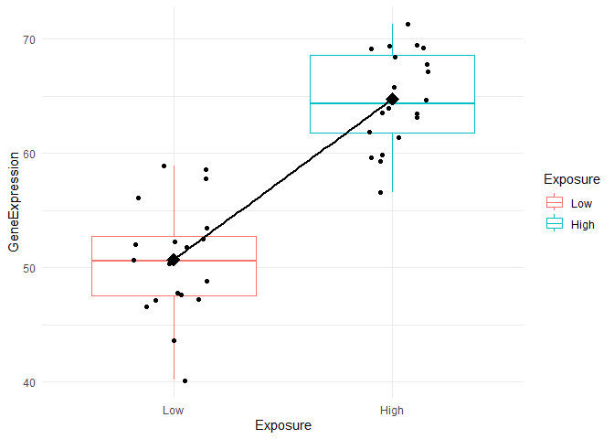
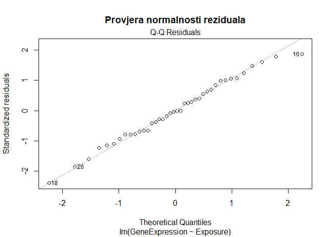
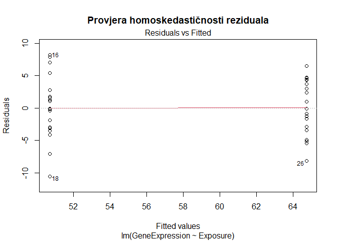
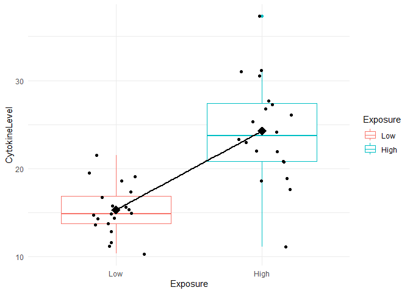
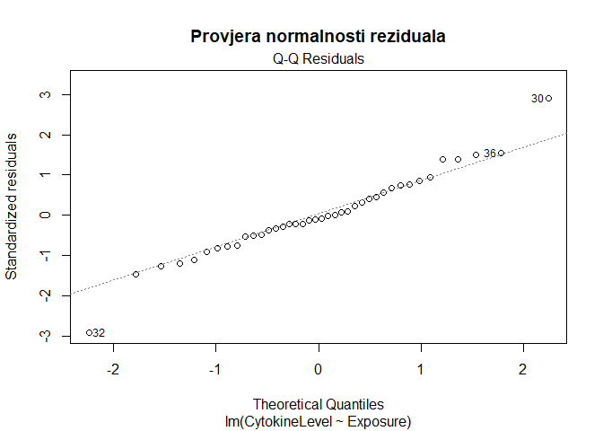
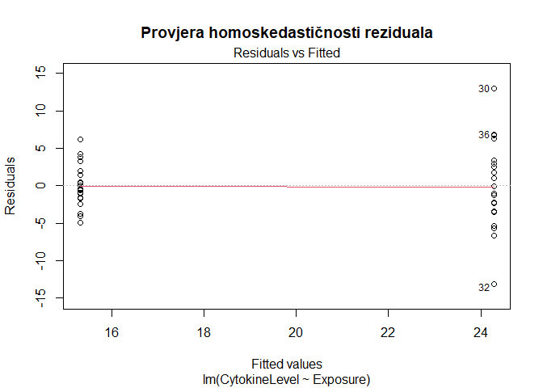
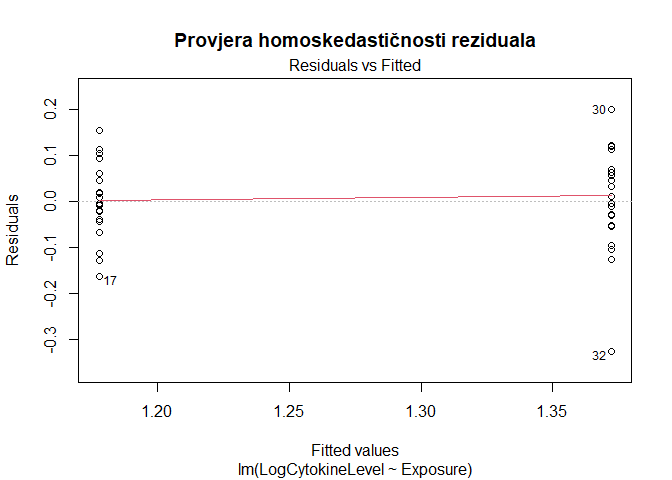
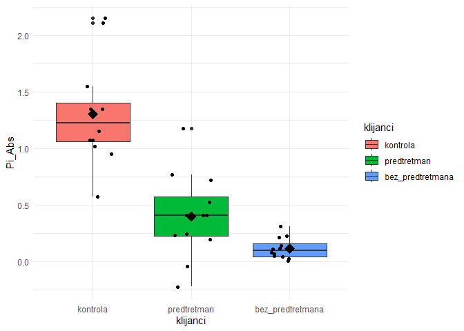
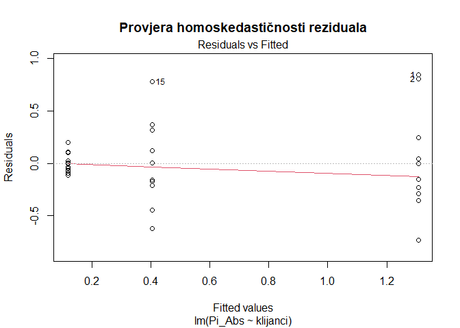
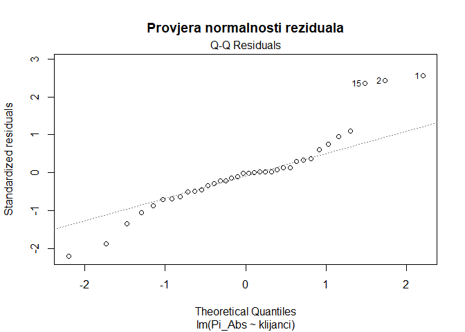

Linearni modeli s kategoričkim prediktorom u R-u
================
Lucija Kanjer
2024/25

### Priprema

``` r
# Učitavanje paketa i postavljanje teme
library(ggplot2)
set_theme(theme_minimal())
```

## 1. Kategorički prediktor s dvije grupe

**Primjer 1: Podaci o vodozemcima**

- *Exposure* - izloženost vodezemaca PCB-u (Low/High)
- *GeneExpression* - ekspresija gena CYP1A1 povezanog s metaboliziranjem
  toksina
- *CytokineLevel* - razina citokina kao imunološki odgovor vodozemaca

``` r
# Učitavanje podataka
amphibians <- read.csv("amphibians.csv")
```

#### Izgled podataka

``` r
head(amphibians)
```

    ##   AmphibianID GeneExpression CytokineLevel Exposure
    ## 1           1       47.19762      12.91588      Low
    ## 2           2       48.84911      14.37625      Low
    ## 3           3       57.79354      11.20381      Low
    ## 4           4       50.35254      21.50687      Low
    ## 5           5       50.64644      18.62389      Low
    ## 6           6       58.57532      11.63067      Low

``` r
str(amphibians)
```

    ## 'data.frame':    40 obs. of  4 variables:
    ##  $ AmphibianID   : int  1 2 3 4 5 6 7 8 9 10 ...
    ##  $ GeneExpression: num  47.2 48.8 57.8 50.4 50.6 ...
    ##  $ CytokineLevel : num  12.9 14.4 11.2 21.5 18.6 ...
    ##  $ Exposure      : chr  "Low" "Low" "Low" "Low" ...

### Pitanje: Postoji li razlika u ekspresiji gena CYP1A1 kod vodozemaca pri niskoj i visikoj izloženosti PCB-u?

#### Vizualizacija

``` r
# Postavljanje faktora
amphibians$Exposure <- factor(amphibians$Exposure, levels = c("Low", "High"))

# Boxplot
ggplot(amphibians, aes(x = Exposure, y = GeneExpression))+
  geom_boxplot(aes(color = Exposure)) + geom_jitter(width = 0.2) + 
  geom_smooth(method = "lm", se = FALSE, aes(group = 1), color = "black") +
  stat_summary(fun.y = mean, geom = "point", shape = 18, size = 5)
```

<!-- -->

**Nulta hipoteza**: ne postoji razlika u *srednjoj vrijednosti*
ekspresije gena CYP1A1 između grupa, smjer pravca = 0 **Alternativna
hipoteza**: postoji razlika u *srednjoj vrijednosti* ekspresije gena
CYP1A1 između grupa, smjer pravca je različit od nule

### 1.1 Postavljanje linearnog modela

``` r
# Linearni model za ovisnost ekspresije gena CYP1A1 o izloženosti PCB-u
model_gene_expression <- lm(GeneExpression ~ Exposure, data = amphibians)
# Rezultati modela
summary(model_gene_expression)
```

    ## 
    ## Call:
    ## lm(formula = GeneExpression ~ Exposure, data = amphibians)
    ## 
    ## Residuals:
    ##      Min       1Q   Median       3Q      Max 
    ## -10.5412  -3.1511  -0.1082   3.1943   8.2264 
    ## 
    ## Coefficients:
    ##              Estimate Std. Error t value Pr(>|t|)    
    ## (Intercept)    50.708      1.011  50.164  < 2e-16 ***
    ## ExposureHigh   14.036      1.430   9.818 5.67e-12 ***
    ## ---
    ## Signif. codes:  0 '***' 0.001 '**' 0.01 '*' 0.05 '.' 0.1 ' ' 1
    ## 
    ## Residual standard error: 4.521 on 38 degrees of freedom
    ## Multiple R-squared:  0.7173, Adjusted R-squared:  0.7098 
    ## F-statistic:  96.4 on 1 and 38 DF,  p-value: 5.67e-12

### Interpretacija linearnog modela za kategorički prediktor s 2 grupe

Objašnjenje:

- Intercept = prosjek grupe “ExpossureLow”
- ExposureHigh = razlika između prosjeka dvije grupe
- t-test za koeficijent = standardni t-test razlike između grupa

### Provjera pretpostavki

- neovisnost podataka (dizajn eksperimenta)
- normalnost reziduaa (Q-Q plot)
- homoskedastičnost tj. jednakost varijanci (Residuals vs. fitted plot)

``` r
# Grafička dijagnostika - provjera pretpostavki normalnosti i homoskedastičnosti reziduala
plot(model_gene_expression, which = 2, main = "Provjera normalnosti reziduala")
```

<!-- -->

``` r
plot(model_gene_expression, which = 1, main = "Provjera homoskedastičnosti reziduala")
```

<!-- -->

**PREDNOSTI KORIŠTENJA LINEARNOG MODELA:**

1.  Dobivamo regresijske koeficijente:
    - Intercept = sredina prve grupe
    - groupTreatment = razlika između grupa (isti rezultat kao t-test)
2.  Dobivamo 95% CI, t statistiku i p vrijednosti u istoj tablici.
3.  Lako možemo analizirati reziduale: plot(model) → dijagnostika
    (normalnost, outlieri, heteroskedastičnost)
4.  Kôd je proširiv ako želimo dodati više grupa ili prediktora

### 1.2 Alternativni način testiranja za 2 grupe: t-test

``` r
### "STARI" NAČIN: klasični t-test
t.test(GeneExpression ~ Exposure, data = amphibians)
```

    ## 
    ##  Welch Two Sample t-test
    ## 
    ## data:  GeneExpression by Exposure
    ## t = -9.8182, df = 37.082, p-value = 7.37e-12
    ## alternative hypothesis: true difference in means between group Low and group High is not equal to 0
    ## 95 percent confidence interval:
    ##  -16.93191 -11.13928
    ## sample estimates:
    ##  mean in group Low mean in group High 
    ##           50.70812           64.74371

Interpretacija

- vrijednost testne statirike t = -9.8182
- p-vrijednost je 7.37e-12
- srednja vrijednost grupe Low = 50.71, a grupe High = 64. 74
- stvarna razlika u srednjim vrijednostima između grupa Low i High leži
  između -16.93 i -11.14 sa 95% pouzdanoti

### Zadatak: Postoji li razlika u razini citokina kod vodozemaca pri niskoj i visikoj izloženosti PCBu?

Napravite viuzalizaciju boxplotom, linarni model, interpretirajte ga te
provjerite pretpostavke modela!

``` r
ggplot(amphibians, aes(x = Exposure, y = CytokineLevel))+
  geom_boxplot(aes(color = Exposure)) + geom_jitter(width = 0.2) + 
  geom_smooth(method = "lm", se = FALSE, aes(group = 1), color = "black") +
  stat_summary(fun.y = mean, geom = "point", shape = 18, size = 5)
```

<!-- -->

``` r
model_cytokine <- lm(CytokineLevel ~ Exposure, data = amphibians)
summary(model_cytokine)
```

    ## 
    ## Call:
    ## lm(formula = CytokineLevel ~ Exposure, data = amphibians)
    ## 
    ## Residuals:
    ##      Min       1Q   Median       3Q      Max 
    ## -13.1355  -2.3217  -0.4266   2.6548  13.0200 
    ## 
    ## Coefficients:
    ##              Estimate Std. Error t value Pr(>|t|)    
    ## (Intercept)    15.319      1.029  14.890  < 2e-16 ***
    ## ExposureHigh    8.961      1.455   6.159 3.45e-07 ***
    ## ---
    ## Signif. codes:  0 '***' 0.001 '**' 0.01 '*' 0.05 '.' 0.1 ' ' 1
    ## 
    ## Residual standard error: 4.601 on 38 degrees of freedom
    ## Multiple R-squared:  0.4996, Adjusted R-squared:  0.4864 
    ## F-statistic: 37.93 on 1 and 38 DF,  p-value: 3.446e-07

``` r
plot(model_cytokine, which = 2, main = "Provjera normalnosti reziduala")
```

<!-- -->

``` r
plot(model_cytokine, which = 1, main = "Provjera homoskedastičnosti reziduala")
```

<!-- -->

### Što kad je homoskadastičnost (jednolikost varijanci) narušena?

**Rješenje:** Transformacija zavisne varijalbe (drugi, korijen, četvrti
korijen, log-transformacija, Box-Cox itd.)

#### Log-transformacija podataka o razini citokina i kreiranje novog modela

``` r
amphibians$LogCytokineLevel <- log10(amphibians$CytokineLevel)

model_log_cytokine <- lm(LogCytokineLevel ~ Exposure, data = amphibians)
summary(model_log_cytokine)
```

    ## 
    ## Call:
    ## lm(formula = LogCytokineLevel ~ Exposure, data = amphibians)
    ## 
    ## Residuals:
    ##      Min       1Q   Median       3Q      Max 
    ## -0.32502 -0.04646 -0.00464  0.06173  0.19961 
    ## 
    ## Coefficients:
    ##              Estimate Std. Error t value Pr(>|t|)    
    ## (Intercept)   1.17798    0.02214  53.198  < 2e-16 ***
    ## ExposureHigh  0.19412    0.03132   6.199 3.04e-07 ***
    ## ---
    ## Signif. codes:  0 '***' 0.001 '**' 0.01 '*' 0.05 '.' 0.1 ' ' 1
    ## 
    ## Residual standard error: 0.09903 on 38 degrees of freedom
    ## Multiple R-squared:  0.5028, Adjusted R-squared:  0.4897 
    ## F-statistic: 38.43 on 1 and 38 DF,  p-value: 3.038e-07

``` r
plot(model_log_cytokine, which = 1, main = "Provjera homoskedastičnosti reziduala")
```

<!-- -->

## 2. Kategorički prediktor s 3 ili više grupa

### Primjer 2: utjecaj toplinskog šoka od 42C na klijance Arabidopsis thaliana

Dataset je proširena verzija pokusa odrađenog u Laboratoriju za
fiziologiju bilja, podatke ustupila dr. sc. Sandra Vitko.

- **klijanci**: kontrola - cijelo vrijeme na 25C, predtretman - na 37C,
  bez_predtretmana - klijanci bez toplinskog predtretmana
- **pi_Abs**: prvi parametar za fotosintetsku učinkovitost
- **FvFm**: drugi parametar za fotosintetsku učinkovitost
- **DREB2A**: ekspresija gena DREB2A povezanog s toplinskom
  aklimatizacijom
- **HSFA3**: ekspresija gena HSFA3 povezanog s toplinskom
  aklimatizacijom

``` r
# Učitavanje podataka o fotosintezi
fotosinteza <- read.csv("fotosinteza.csv")
head(fotosinteza)
```

    ##   klijanci    Pi_Abs      FvFm     DREB2A      HSFA3
    ## 1 kontrola 2.1537050 0.7298886 0.08523476 0.07392176
    ## 2 kontrola 2.1147227 0.7505594 0.07156070 0.07248826
    ## 3 kontrola 1.5531119 0.6899303 0.14417882 0.06490845
    ## 4 kontrola 1.0211650 0.6982168 0.09806097 0.06710288
    ## 5 kontrola 0.9560219 0.7766776 0.08435560 0.07870170
    ## 6 kontrola 1.3491763 0.7167710 0.13317823 0.06640843

### Pitanje: Postoji li razlika u fotosintetskoj učinkovitosti (Pi_Abs) između klijanaca sa i bez predtretmana te kontrolne skupine?

**Nulta hipoteza**: Ne postoji razlika u srednjoj vrijednosti Pi_Abs
između između grupa, pravac smjera za svaku od grupa = 0 **Alternativna
hipoteza**: Postoji razlika u srednjoj vrijednosti između bar 2 para
grupa i bar jedan od pravaca smjera je različiti od nule

#### Vizualizacija boxplotom

``` r
# Postavljanje ispravnog redoslijeda faktora
fotosinteza$klijanci <- factor(fotosinteza$klijanci, 
                               levels = c("kontrola","predtretman","bez_predtretmana"))


# Boxplot s oznakom srednje vrijednosti grupa klijanaca
ggplot(fotosinteza, aes(x = klijanci, y = Pi_Abs))+
  geom_boxplot(aes(fill = klijanci)) + geom_jitter(width = 0.2) + 
  stat_summary(fun.y = mean, geom = "point", shape = 18, size = 5)
```

<!-- -->

### 2.1 Postavljanje linearnog modela

``` r
model_Pi_Abs <- lm(Pi_Abs ~ klijanci, data = fotosinteza)
summary(model_Pi_Abs)
```

    ## 
    ## Call:
    ## lm(formula = Pi_Abs ~ klijanci, data = fotosinteza)
    ## 
    ## Residuals:
    ##     Min      1Q  Median      3Q     Max 
    ## -0.7316 -0.1616 -0.0041  0.1026  0.8465 
    ## 
    ## Coefficients:
    ##                          Estimate Std. Error t value Pr(>|t|)    
    ## (Intercept)               1.30722    0.09973  13.107 1.24e-14 ***
    ## klijancipredtretman      -0.90349    0.14104  -6.406 2.94e-07 ***
    ## klijancibez_predtretmana -1.18937    0.14104  -8.433 9.63e-10 ***
    ## ---
    ## Signif. codes:  0 '***' 0.001 '**' 0.01 '*' 0.05 '.' 0.1 ' ' 1
    ## 
    ## Residual standard error: 0.3455 on 33 degrees of freedom
    ## Multiple R-squared:  0.7014, Adjusted R-squared:  0.6833 
    ## F-statistic: 38.75 on 2 and 33 DF,  p-value: 2.187e-09

**Objašnjenje modela:**

- Intercept = prosjek grupe “klijanci kontrola”
- klijancipredtretman = razlika između klijanci predtretman i klijanci
  kontrola
- klijancibez_predtretmana = razlika između klijanci bez_predtretmana i
  klijanci kontrola
- F-test = standardna jednofaktorska analiza varijance (ANOVA)

## 2.2 Alternativni način testiranja za 3+ grupe: Analiza varijance (ANOVA)

``` r
anova_Pi_Abs <- aov(Pi_Abs ~ klijanci, data = fotosinteza)
summary(anova_Pi_Abs)
```

    ##             Df Sum Sq Mean Sq F value   Pr(>F)    
    ## klijanci     2  9.251   4.625   38.75 2.19e-09 ***
    ## Residuals   33  3.939   0.119                     
    ## ---
    ## Signif. codes:  0 '***' 0.001 '**' 0.01 '*' 0.05 '.' 0.1 ' ' 1

``` r
# Tukey Post-hoc test za provjeru između kojih grupa postoji razlika
TukeyHSD(anova_Pi_Abs)
```

    ##   Tukey multiple comparisons of means
    ##     95% family-wise confidence level
    ## 
    ## Fit: aov(formula = Pi_Abs ~ klijanci, data = fotosinteza)
    ## 
    ## $klijanci
    ##                                    diff        lwr         upr     p adj
    ## predtretman-kontrola         -0.9034855 -1.2495777 -0.55739340 0.0000009
    ## bez_predtretmana-kontrola    -1.1893743 -1.5354665 -0.84328219 0.0000000
    ## bez_predtretmana-predtretman -0.2858888 -0.6319809  0.06020335 0.1215707

**PREDNOSTI lm() u odnosu na ANOVA-u:**

1.  aov() i lm() daju isti F test — ali lm() daje i koeficijente:
    klijancipredtretman = razlika klijanci predtretman - klijanci
    kontrola klijancibez_predtretmana = razlika klijanci
    bez_predtretmana - klijanci kontrola
2.  Možemo odmah vidjeti iznose razlika, ne samo da “postoji razlika”.
3.  Dodavanje kovarijata je trivijalno (ANCOVA): generičan primjer:
    lm(mass ~ habitat + sunlight)
4.  Interakcije vrlo jednostavne: generičan primjer:lm(mass ~ habitat \*
    fertilizer)
5.  Bolja dijagnostika modela: plot(model\_)

### Provjera pretpostavki normalnosti i homoskadastičnosti

``` r
plot(model_Pi_Abs, which = 1, main = "Provjera homoskedastičnosti reziduala")
```

<!-- -->

``` r
plot(model_Pi_Abs, which = 2, main = "Provjera normalnosti reziduala")
```

<!-- -->

#### Što kad normalnost reziduala nije zadovoljena?

1.  **Ništa** - linearni model je dovoljno robustan za manja do umjerena
    odstupanja u normalnosti reziduala.
2.  Outlieri - provjeriti mogu li se odbaciti (greške u mjerenju) i je
    li se time poboljšala normalnost.
3.  Transformacija zavisne varijable (sve manje korištena u praksi).
4.  Korištenje metoda koje nemaju pretpostavku normalne distribucije:
    **neparametrijske metode i GLM-ovi.**

## Zadaci

Napravi vizualizaciju podataka boxplotom i linarni model za svako od
pitanja. Postoji li razlika i između kojih grupa?

1.  Postoji li razlika u fotosintetskoj učinkovitosti (FvFm) između
    klijanaca sa i bez predtrtmana te kontrolne skupine?
2.  Postoji li razlika u ekspresiji gena DREB2A između klijanaca sa i
    bez predtrtmana te kontrolne skupine?
3.  Postoji li razlika u ekspresiji gena HSFA3 između klijanaca sa i bez
    predtrtmana te kontrolne skupine?

## Kviz

Poveznica na kviz za vježbu 6 (Linearna regresija) i vježbu 7 (Linearni
modeli s kategoričkim prediktorom):
<https://forms.cloud.microsoft/e/9CTipbdFGn?origin=lprLink>

## Dodatni izvori

- Common statistical tests are linear models By Jonas Kristoffer
  Lindeløv <https://lindeloev.github.io/tests-as-linear/>
