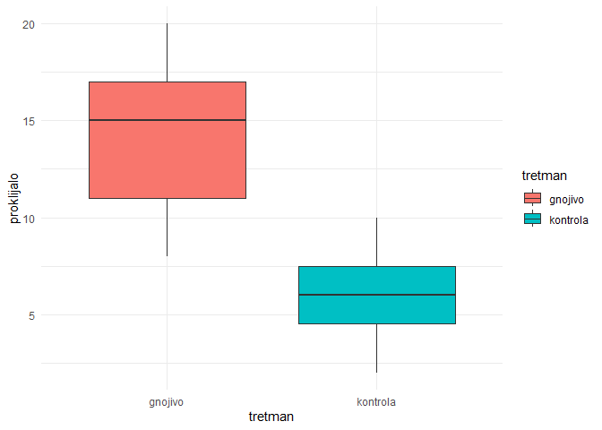
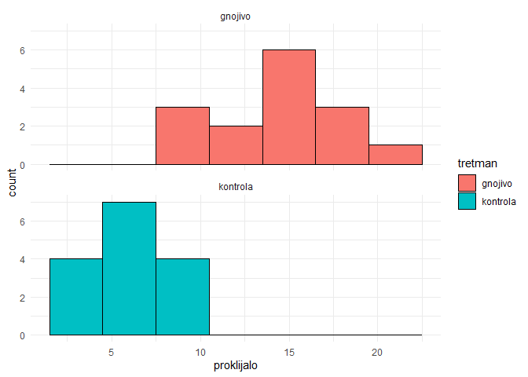
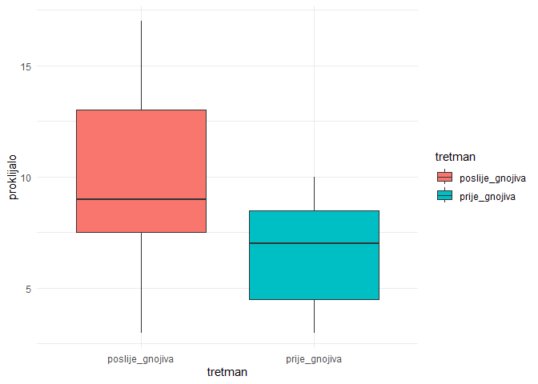
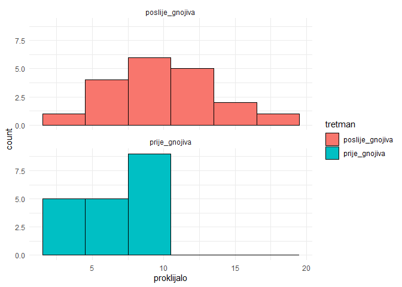
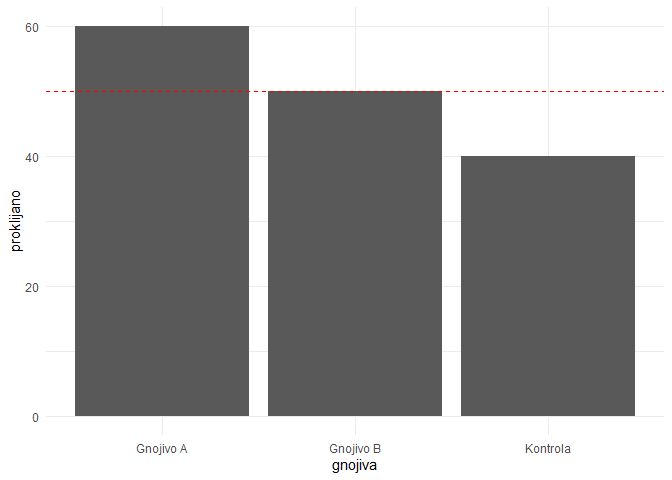

Neparametrijska statistika i statistika kategoričkih podataka
================
Lucija Kanjer, <lucija.kanjer@biol.pmf.hr>
\`2025/26

## Sadržaj ove vježbe

Neparametrijska statistika

- Wilcoxon-Mann-Whitney test
- Wilcoxon test za uparene uzorke

Statistika kategoričkih podataka

- Chi-kvadrat test
- Binomialni test

## Tema: pokusi s klijancima biljaka

- **Pokus 1**: Je li broj klijanaca značajno drugačiji bez i s dodatkom
  gnojiva?
- **Pokus 2**: Je li broj plodova na biljkama značajno drugačiji prije i
  poslije dodatka gnojiva?
- **Pokus 3**: Je li broj klijanaca iz 3 različita gnojiva značajno
  drugačiji od očekivanog?
- **Pokus 4**: Je li broj uspješno proklijanih sjemenki 60%?

``` r
# Priprema
library(tidyr)
library(ggplot2)
set_theme(theme_minimal())
```

# 1. Neparametrijska statistika - neovisni uzorci

**Pokus 1**: Broj uspjeha klijanja sjemenki bez gnojiva (kontrola) i s
gnojivom

Je li broj klijanaca značajno drugačiji bez i sa dodatkom gnojiva?

``` r
# Učitavanje dataseta
biljke_pokus1 <- read.csv("biljke_pokus1.csv")

# Uvid u podatke 
head(biljke_pokus1)
```

    ##   kontrola gnojivo
    ## 1        4      19
    ## 2        8      10
    ## 3        5       8
    ## 4       10      11
    ## 5        2      19
    ## 6        6      18

## Vizualizacija razlika između grupa

#### Kreiranje tablice u dugačkom (long) formatu

``` r
# Kreiranje tablice u dugačkom (long) formatu - za crtanje plotova

biljke_pokus1$id_retka <- c(1:15) # dodavanje stupca za identifikaciju redaka

biljke_pokus1_long <- pivot_longer(biljke_pokus1, cols = c(kontrola, gnojivo), names_to = "tretman", values_to = "proklijalo")

head(biljke_pokus1_long)
```

    ## # A tibble: 6 × 3
    ##   id_retka tretman  proklijalo
    ##      <int> <chr>         <int>
    ## 1        1 kontrola          4
    ## 2        1 gnojivo          19
    ## 3        2 kontrola          8
    ## 4        2 gnojivo          10
    ## 5        3 kontrola          5
    ## 6        3 gnojivo           8

### Boxplot

``` r
# Vizualizacija podataka iz pokusa 1
ggplot(biljke_pokus1_long, aes(x = tretman, y = proklijalo, fill = tretman)) +
  geom_boxplot()
```

<!-- -->

### Histogram - Vizualizacija distribucije podataka

``` r
# Histogrami
ggplot(biljke_pokus1_long, aes(x = proklijalo, fill = tretman)) +
  geom_histogram(binwidth = 3, color = "black") + facet_wrap (~ tretman, nrow = 2)
```

<!-- -->

## Ima li statistički značajne razlike između grupa kontrola i gnojivo?

- Podaci **nisu normalno distribuirani**, stoga ne možemo koristiti
  t-test!
- Moramo koristiti test koji **ne pretpostavlja** normalnu distribuciju
  podataka.
- Koristimo **neparamatrijsku statistiku**

**Wilcoxon-Mann-Whitney rank-sum test (Mann-Whitney U)**

- neparametrijska verzija t-testa
- Prednosti: nema pretpostavke o distribuciji podataka, pogodan za mali
  broj opažanja
- Mane: manja statistička snaga testa

## Wilcoxon-Mann-Whitney test za neovisne uzorke

#### <code> wilcox.test(grupa1, grupa2) </code>

#### Vraćanje tablice u široki (wide) format - za testiranje

``` r
# Kreiranje tablice u širokom (wide) formatu - za testiranje
biljke_pokus1_wide <- pivot_wider(biljke_pokus1_long, names_from = tretman, values_from = proklijalo)

head(biljke_pokus1_wide)
```

    ## # A tibble: 6 × 3
    ##   id_retka kontrola gnojivo
    ##      <int>    <int>   <int>
    ## 1        1        4      19
    ## 2        2        8      10
    ## 3        3        5       8
    ## 4        4       10      11
    ## 5        5        2      19
    ## 6        6        6      18

``` r
# Wilcoxon-Mann-Whitney test za neovisne uzorke
wilcox.test(biljke_pokus1_wide$kontrola, biljke_pokus1$gnojivo)
```

    ## 
    ##  Wilcoxon rank sum test with continuity correction
    ## 
    ## data:  biljke_pokus1_wide$kontrola and biljke_pokus1$gnojivo
    ## W = 7, p-value = 1.258e-05
    ## alternative hypothesis: true location shift is not equal to 0

## Rezultati Wilcoxon-Mann-Whitney testa

**Nulta hipoteza**: Ne postoji značajna razlika između broja klijanaca u
konrolnoj grupi i u grupi koja je tretirana gnojivom.

- **W = 9** - Ovo je statistika testa, koja predstavlja rang-sum razliku
  između skupina. Sama po sebi nema biološki značaj, ali se koristi za
  izračunavanje p-vrijednosti.

- **p-value = 1.251e-06** - Ovo je jako mala p-vrijednost, znatno manja
  od uobičajene razine značajnosti (npr., 0.05).

- Značajna p-vrijednost ukazuje na **odbacivanje nul-hipoteze** (da ne
  postoji razlika između distribucija dvije skupine).

- Implikacije: Tretman gnojivom vjerojatno ima učinak na uspjeh biljaka
  (npr., povećava ili smanjuje uspjeh u odnosu na kontrolu)

# 2. Neparametrijska statistika - upareni uzorci

**Pokus 2**: broj plodova prije i poslije dodatka gnojiva

Je li broj plodova na biljkama značajno drugačiji prije i poslije
dodatka gnojiva?

``` r
# Učitajte dataset!
biljke_pokus2 <- read.csv("biljke_pokus2.csv")

head(biljke_pokus2)
```

    ##   prije_gnojiva poslije_gnojiva
    ## 1            10               9
    ## 2             9              13
    ## 3             8              11
    ## 4             9              11
    ## 5             3               3
    ## 6             7               6

## Vizualizacija pomoću boxplota

``` r
# Vizualizacija podataka iz pokusa 2
# Kreiranje tablice u dugačkom (long) formatu - za crtanje plotova
biljke_pokus2$id_biljke <- c(1:19)

biljke_pokus2_long <- pivot_longer(biljke_pokus2, 
                                   cols = c(prije_gnojiva, poslije_gnojiva), 
                                   names_to = "tretman", 
                                   values_to = "proklijalo")

# Vizualizacija podataka iz pokusa 1
ggplot(biljke_pokus2_long, aes(x = tretman, y = proklijalo, fill = tretman)) +
  geom_boxplot() + geom_point() + geom_line(aes(group = id_biljke), alpha = 0.5)
```

<!-- -->

## Vizualizacija distribucije podataka

``` r
# Histogrami
ggplot(biljke_pokus2_long, aes(x = proklijalo, fill = tretman)) +
  geom_histogram(binwidth = 3, color = "black") + facet_wrap (~ tretman, nrow = 2)
```

<!-- -->

## Ima li statistički značajne razlike između broja plodova na biljci prije i nakon dodatka gnojiva?

- koristimo neparametrijski test za uparene uzorke

**Wilcoxon signed rank test**

- neparametrijska verzija t-testa za uparene (ovisne) uzorke

## Wilcoxonov test za uparene uzorke

<code>wilcox.test(prije, poslije, **paired = TRUE**)</code>

``` r
# Wilcoxonov test za uparene uzorke
wilcox.test(biljke_pokus2$prije_gnojiva, biljke_pokus2$poslije_gnojiva, 
            paired = TRUE)
```

    ## 
    ##  Wilcoxon signed rank test with continuity correction
    ## 
    ## data:  biljke_pokus2$prije_gnojiva and biljke_pokus2$poslije_gnojiva
    ## V = 12, p-value = 0.001398
    ## alternative hypothesis: true location shift is not equal to 0

## Rezultati Wilcoxonovog testa za uparene uzorke

- V = 20 - Ovo je statistika testa, koja predstavlja sumu rangova
  apsolutnih razlika između uparenih mjerenja. Sama po sebi nije
  intuitivna, ali se koristi za izračun p-vrijednosti.
- **p-value = 0.0007076** - Ovo je jako mala p-vrijednost, što ukazuje
  na značajnu razliku između uparenih skupina.

## Statistika kategoričkih podataka

**Pokus 3**: Postotak uspješno proklijalih sjemenki gnojiva A, gnojiva B
i kontrolne skupine

Je li broj klijanaca iz 3 različita gnojiva značajno drugačiji od
očekivanog (svi podjednaki uspjeh)?

``` r
# Učitajte dataset!
biljke_pokus3 <- read.csv("biljke_pokus3.csv")

print(biljke_pokus3)
```

    ##     gnojiva proklijano ocekivano
    ## 1 Gnojivo A         60        50
    ## 2 Gnojivo B         50        50
    ## 3  Kontrola         40        50

## 

``` r
# Vizualizacija podataka
ggplot(biljke_pokus3, aes(x = gnojiva, y = proklijano)) +
  geom_bar(stat = "identity", position = "dodge") +
  geom_hline(aes(yintercept = ocekivano), color = "red", linetype = "dashed")
```

<!-- -->

# 3. Hi-hvadrat test

Kada koristiti?

Tip podataka: Test se koristi za **kategoričke podatke**, gdje
analiziramo brojeve u različitim kategorijama .

Očekivane frekvencije: Test procjenjuje **odstupanja između promatranih
frekvencija i očekivanih frekvencija**, koje su definirane na temelju
očekivane raspodjele (npr. jednake raspodjele za svaku kategoriju).

## Hi-hvadrat test

<code>chisq.test(promatrano, p = ocekivano / sum(ocekivano))</code>

``` r
# Hi-kvadrat test
chisq.test(biljke_pokus3$proklijano, p = biljke_pokus3$ocekivano / sum(biljke_pokus3$ocekivano))
```

    ## 
    ##  Chi-squared test for given probabilities
    ## 
    ## data:  biljke_pokus3$proklijano
    ## X-squared = 4, df = 2, p-value = 0.1353

## Rezultati hi-kvadrat testa

- Chi-kvadrat statistika: ***X*-squared** = 4: Ovo je testna statistika
  koja mjeri koliko promatrane vrijednosti odstupaju od očekivanih
  vrijednosti. Veće vrijednosti ukazuju na veća odstupanja između
  promatranih i očekivanih frekvencija.

- Stupnjevi slobode (df): **df = 2**: Broj stupnjeva slobode u ovom
  testu je broj kategorija minus 1 (3 kategorije - 1 = 2).

- p-vrijednost: **p-value = 0.1353**: Ova p-vrijednost je veća od
  uobičajene razine značajnosti (npr., 0.05). stoga ne možemo odbaciti
  nul hipotezu. Nema značajnih razlika između promatranih frekvencija
  proklijalih sjemenki i očekivanih vrijednosti. Razlike u broju
  proklijalih sjemenki između kategorija (Gnojivo A, Gnojivo B i
  Kontrola) mogle su se dogoditi slučajno.

# 4. Statistika binomnih podataka

**Pokus 4**: Razvijamo novo gnojivo te želimo testirati je li bolje od
starog gnojiva. Znamo da staro gnojivo ima stopu klijanja 60%. Od 25
sjemenki, 18 je uspješno proklijalo.

Je li broj uspješno proklijanih sjemenki statistički značajno drugačiji
od 60%?

``` r
# Učitavanje dataseta
biljke_pokus4 <- read.csv("biljke_pokus4.csv")

print(biljke_pokus4)
```

    ##   klijanci broj_sjemenki vjerojatnost
    ## 1       18            25          0.6

## Koristimo **binomialni test**

Kada koristiti binomialni test?

- Kada analiziramo **binarne podatke** (uspjeh/neuspjeh).
- Kada želite testirati vjerojatnost uspjeha u odnosu na **poznatu ili
  pretpostavljenu** vrijednost.
- Kada je **uzorak malen**, pa aproksimativne metode nisu dovoljno
  precizne.

## Binomialni test u R-u

<code>binom.test(uspjesi, pokušaji, p = vjerojatnost)</code>

``` r
# Binomialni test
binom.test(biljke_pokus4$klijanci, biljke_pokus4$broj_sjemenki, p = biljke_pokus4$vjerojatnost)
```

    ## 
    ##  Exact binomial test
    ## 
    ## data:  biljke_pokus4$klijanci and biljke_pokus4$broj_sjemenki
    ## number of successes = 18, number of trials = 25, p-value = 0.3073
    ## alternative hypothesis: true probability of success is not equal to 0.6
    ## 95 percent confidence interval:
    ##  0.5061232 0.8792833
    ## sample estimates:
    ## probability of success 
    ##                   0.72

## Rezultati binomialnog testa

- **p = 0.3073** - P-vrijednost je veća od uobičajene razine značajnosti
  (npr., 0.05). Ovo sugerira da ne možemo odbaciti nul-hipotezu. Drugim
  riječima, nema dovoljno dokaza da je stvarna vjerojatnost uspjeha
  različita od 0.6.

- Interval pouzdanosti (95%): **(0.5061,0.8793)**: Stvarna vjerojatnost
  uspjeha (temeljena na uzorku) s 95% pouzdanosti leži unutar ovog
  raspona. Interval uključuje očekivanu vjerojatnost (0.6), što dodatno
  podržava zaključak da nema značajne razlike.

- Procjena stvarne vjerojatnosti uspjeha: Procijenjena vjerojatnost
  uspjeha temeljem podataka je **0.72** (tj. 18/25), ali ta vrijednost
  nije značajno različita od 0.6 prema ovom testu.

## Samostalni zadaci:

### **Tema: Utjecaj različitih prehrana na težinu miševa**

#### Zadatak 1

- Učitajte tablicu “misevi_zadatak1.csv”
- Napravite boxplot podataka
- Napravite histograme za varijable.
- Jesu li težine miševa pod prehranom A i prehranom B značajno
  različite?

#### Zadatak 2

- Učitajte tablicu “misevi_zadatak2.csv”
- Napravite boxplot podataka
- Napravite histograme za varijable.
- Postoji li značajna razlika između težina miševa prije i poslije
  promjene prehrane?

#### Zadatak 3

- Učitajte tablicu “misevi_zadatak3.csv”
- Napravite barplot.
- Promatrani broj miševa s poboljšanjem težine pod tri različite
  prehrane:
- Postoji li značajna razlika između promatranih i očekivanih rezultata?

#### Zadatak 4

- Učitajte tablicu “misevi_zadatak4.csv”
- Od 15 miševa pod određenom prehranom, njih 10 je pokazalo poboljšanje
  težine.
- Je li postotak poboljšanja značajno različit od očekivanih 50%?
