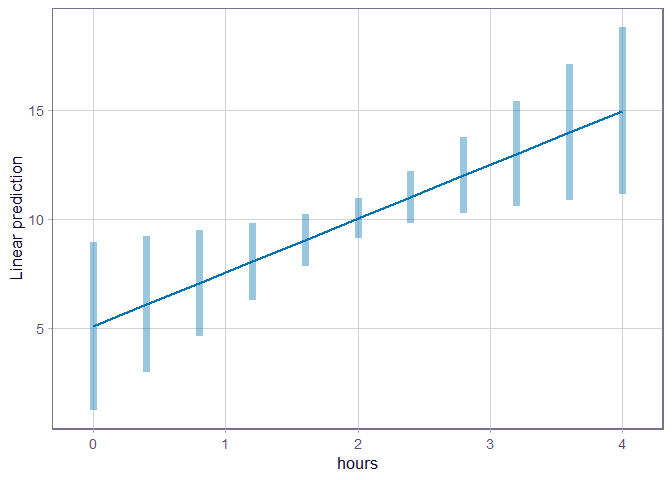
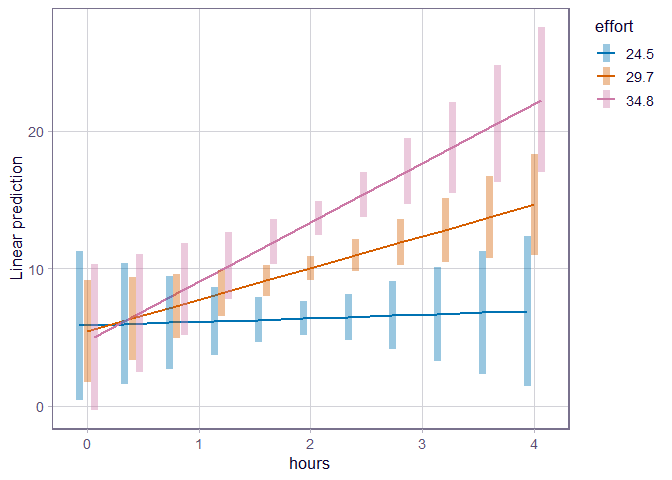
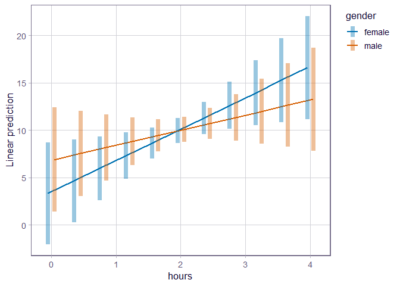
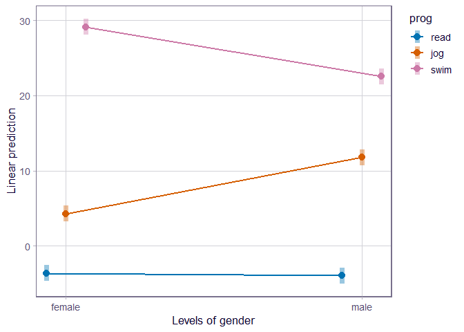
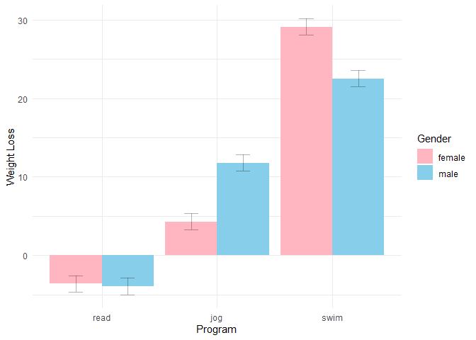

Linearni modeli s više prediktora i njihovim interakcijama
================
2025/26

## Sadržaj predavanja

Linearni modeli s 3 tipa interakcija prediktora (nezavisne varijable):

1.  interakcija **2 kontinuirane** varijable
2.  interakcija **kontinuirane i kategoričke** varijable
3.  interakcija **2 kategoričke** varijable.

## A) Priprema podataka

Učitavamo gotov primjer podataka koji sadrži informacije o **gubitku
mase** (loss), **vremenu vježbanja** (hours), **trudu tijekom
vježbanja** (effort), **spolu** (gender) i programu: plivanje,
joggiranje i kontrola (prog).

Primjer je preuzet sa stranice:
<https://stats.oarc.ucla.edu/r/seminars/interactions-r/>

``` r
#a1) učitavanje paketa #
#install.packages("emmeans")
library(emmeans)
library(ggplot2)

# a2) učitavanje tablice sa web izvora #
dat <- read.csv("https://stats.idre.ucla.edu/wp-content/uploads/2019/03/exercise.csv")
head(dat)
```

    ##   id     loss    hours   effort gender prog
    ## 1  1 18.02226 1.836704 37.71218      1    1
    ## 2  2 10.18642 2.389360 26.72401      1    1
    ## 3  3 19.74728 2.362117 36.31657      1    1
    ## 4  4  1.88360 2.520866 20.70048      1    1
    ## 5  5 14.24259 1.889828 24.72712      1    1
    ## 6  6 19.69473 2.367162 33.66948      1    1

``` r
#a3) pretvori kategoričke varijable u faktore #
dat$prog <- factor(dat$prog,labels=c("jog","swim","read"))
dat$gender <- factor(dat$gender,labels=c("male","female"))
```

## B) PONOVIMO: LINEARNI MODEL S JEDNIM KONTINUIRANIM PREDIKTOROM

**Pitanje**: Povećava li se gubitak mase s brojem sati vježbanja?

``` r
#b1) linearni model ovisnosti gubitka mase o vremenu vježbanja #
cont <- lm(loss~hours,data=dat)
summary(cont)
```

    ## 
    ## Call:
    ## lm(formula = loss ~ hours, data = dat)
    ## 
    ## Residuals:
    ##     Min      1Q  Median      3Q     Max 
    ## -27.164 -11.388  -2.086  10.011  42.787 
    ## 
    ## Coefficients:
    ##             Estimate Std. Error t value Pr(>|t|)   
    ## (Intercept)   5.0757     1.9550   2.596  0.00958 **
    ## hours         2.4696     0.9479   2.605  0.00933 **
    ## ---
    ## Signif. codes:  0 '***' 0.001 '**' 0.01 '*' 0.05 '.' 0.1 ' ' 1
    ## 
    ## Residual standard error: 14.06 on 898 degrees of freedom
    ## Multiple R-squared:  0.007502,   Adjusted R-squared:  0.006397 
    ## F-statistic: 6.788 on 1 and 898 DF,  p-value: 0.009329

Sažetak modela (ponovimo): - Intercept: očekivani gubitak mase kada je
hours = 0 (ne interpretira se) - hours: promjena gubitka mase za svaki
dodatni sat vježbanja

### Crtanje regresijskog pravca

- pomoću paketa emmeans (naredba emmip)
- definiramo raspon vrijednosti sati vježbanja koje želimo prikazati i
  spremamo u objekt “mylist”
- emmip crta predviđene vrijednosti iz modela s intervalima pouzdanosti

``` r
#b5) crtanje regresijskog pravca pomoću paketa emmeans #
(mylist <- list(hours=seq(0,4,by=0.4)))
```

    ## $hours
    ##  [1] 0.0 0.4 0.8 1.2 1.6 2.0 2.4 2.8 3.2 3.6 4.0

``` r
emmip(cont,~hours,at=mylist, CIs=TRUE)
```

<!-- -->

## C) LINEARNI MODEL S 2 KONTINUIRANA PREDIKTORA I NJIHOVOM INTERAKCIJOM

**Pitanje**: Povećava li se gubitak mase s brojem sati vježbanja i
povećanjem razine truda tijekom vježbanja?

``` r
#c1) linearni model gubitka mase o vremenu i trudu vježbanja #
contcont <- lm(loss~hours*effort,data=dat)
summary(contcont)
```

    ## 
    ## Call:
    ## lm(formula = loss ~ hours * effort, data = dat)
    ## 
    ## Residuals:
    ##    Min     1Q Median     3Q    Max 
    ## -29.52 -10.60  -1.78  11.13  34.51 
    ## 
    ## Coefficients:
    ##              Estimate Std. Error t value Pr(>|t|)  
    ## (Intercept)   7.79864   11.60362   0.672   0.5017  
    ## hours        -9.37568    5.66392  -1.655   0.0982 .
    ## effort       -0.08028    0.38465  -0.209   0.8347  
    ## hours:effort  0.39335    0.18750   2.098   0.0362 *
    ## ---
    ## Signif. codes:  0 '***' 0.001 '**' 0.01 '*' 0.05 '.' 0.1 ' ' 1
    ## 
    ## Residual standard error: 13.56 on 896 degrees of freedom
    ## Multiple R-squared:  0.07818,    Adjusted R-squared:  0.07509 
    ## F-statistic: 25.33 on 3 and 896 DF,  p-value: 9.826e-16

- Postoji značajna interakcija između vremena vježbanja (hours) i truda
  (effort) (p = 0.036). To znači da učinak sati vježbanja na gubitak
  mase ovisi o razini truda.
- Kada je trud nizak, povećanje sati vježbanja ne dovodi nužno do većeg
  gubitka mase (sam efekt hours nije značajan).
- Kada je interakcija prediktora značajna, ne interpretiramo utjecaj
  pojedinačnih varijabli - sam trud (effort) nema značajan izravan
  učinak na gubitak mase.
- Model je ukupno statistički značajan, ali objašnjava relativno mali
  dio varijabilnosti u gubitku mase (R² ≈ 0.08).

#### Definiranje niske, srednje i visoke razine truda

- Koristimo srednju vrijednost ± standardnu devijaciju

``` r
# definiranje visoke, niske i srednje razine truda #
effa <- mean(dat$effort) + sd(dat$effort)
eff <- mean(dat$effort)
effb <- mean(dat$effort) - sd(dat$effort)

# zaokruživanje razine truda na jedno decimalno mjesto
effar <- round(effa,1)
effr <- round(eff,1)
effbr <- round(effb,1)

#kreiranje liste razina truda i sati za koje želimo predviđanje
mylist <- list(hours=seq(0,4,by=0.4),effort=c(effbr,effr,effar))

#crtanje regresijskog pravca za svaku razinu truda
emmip(contcont,effort~hours,at=mylist, CIs=TRUE)
```

<!-- -->

## D) LINEARNI MODEL S 1 KATEGORIČKIM i 1 KONTINUIRANIM PREDIKTOROM I NJIHOVOM INTERAKCIJOM

**Pitanje**: Kako sati vježbanja utječu na gubitak mase s obzirom na
spol(m/Ž)?

``` r
class(dat$gender)#provjera je li spremljeno kao faktor
```

    ## [1] "factor"

``` r
levels(dat$gender)#provjera kategorija
```

    ## [1] "male"   "female"

### Priprema za izradu modela ???

``` r
#d1) jednostavni model kad je muški spol referentna kategorija
catm <- lm(loss~gender,data=dat)
summary(catm)
```

    ## 
    ## Call:
    ## lm(formula = loss ~ gender, data = dat)
    ## 
    ## Residuals:
    ##     Min      1Q  Median      3Q     Max 
    ## -27.067 -11.788  -2.156   9.977  44.222 
    ## 
    ## Coefficients:
    ##              Estimate Std. Error t value Pr(>|t|)    
    ## (Intercept)   10.1129     0.6650  15.206   <2e-16 ***
    ## genderfemale  -0.1842     0.9405  -0.196    0.845    
    ## ---
    ## Signif. codes:  0 '***' 0.001 '**' 0.01 '*' 0.05 '.' 0.1 ' ' 1
    ## 
    ## Residual standard error: 14.11 on 898 degrees of freedom
    ## Multiple R-squared:  4.271e-05,  Adjusted R-squared:  -0.001071 
    ## F-statistic: 0.03835 on 1 and 898 DF,  p-value: 0.8448

``` r
#d2)promjeni razine kategorija tako da ženski spol bude razina 1 (referentna grupa)
dat$gender <- relevel(dat$gender, ref="female")
levels(dat$gender)
```

    ## [1] "female" "male"

### Izrada modela

``` r
#d3) izrada modela
contcat <- lm(loss~hours*gender,data=dat)
summary(contcat)
```

    ## 
    ## Call:
    ## lm(formula = loss ~ hours * gender, data = dat)
    ## 
    ## Residuals:
    ##     Min      1Q  Median      3Q     Max 
    ## -27.118 -11.350  -1.963  10.001  42.376 
    ## 
    ## Coefficients:
    ##                  Estimate Std. Error t value Pr(>|t|)  
    ## (Intercept)         3.335      2.731   1.221    0.222  
    ## hours               3.315      1.332   2.489    0.013 *
    ## gendermale          3.571      3.915   0.912    0.362  
    ## hours:gendermale   -1.724      1.898  -0.908    0.364  
    ## ---
    ## Signif. codes:  0 '***' 0.001 '**' 0.01 '*' 0.05 '.' 0.1 ' ' 1
    ## 
    ## Residual standard error: 14.06 on 896 degrees of freedom
    ## Multiple R-squared:  0.008433,   Adjusted R-squared:  0.005113 
    ## F-statistic:  2.54 on 3 and 896 DF,  p-value: 0.05523

Interpretacija rezultata

- hours je značajan: više sati - veći gubitak mase.
- Spol (gender) nije značajan.
- Interakcija hours:gender nije značajna.
- Muškarci i žene ne razlikuju se u tome kako sati vježbanja utječu na
  gubitak mase.Učinak sati vježbanja je sličan za oba spola.

#### Vizualizacija ovisnosti gubitka mase o broju sati i spolu

``` r
#d7) plot using emmip
(mylist <- list(hours=seq(0,4,by=0.4),gender=c("female","male")))
```

    ## $hours
    ##  [1] 0.0 0.4 0.8 1.2 1.6 2.0 2.4 2.8 3.2 3.6 4.0
    ## 
    ## $gender
    ## [1] "female" "male"

``` r
emmip(contcat, gender ~hours, at=mylist,CIs=TRUE)
```

<!-- -->

**OPREZ!** Iako na grafu vidimo dva pravca različitog nagiba, vidimo da
se **intervali pouzdanosti preklapaju**, što i vizualno pokazuje kako
**spol nije značajan faktor** u ovom modelu!

## E) LINEARNI MODEL S 2 KATEGORIČKA PREDIKTORA I NJIHOVOM INTERAKCIJOM

**Pitanje**: Utječe li program vježbanja i spol na gubitak tjelesne
mase?

``` r
#e1)
#promjeni razine kategorija tako da čitanje bude razina 1 (referentna grupa)
dat$prog <- relevel(dat$prog, ref="read")
#promjeni razine kategorija tako da ženski spol bude razina 1 (referentna grupa)
dat$gender <- relevel(dat$gender, ref="female")
```

### Izrada modela

``` r
#e2) izrada modela
catcat <- lm(loss~gender*prog,data=dat)
summary(catcat)
```

    ## 
    ## Call:
    ## lm(formula = loss ~ gender * prog, data = dat)
    ## 
    ## Residuals:
    ##      Min       1Q   Median       3Q      Max 
    ## -19.1723  -4.1894  -0.0994   3.7506  27.6939 
    ## 
    ## Coefficients:
    ##                     Estimate Std. Error t value Pr(>|t|)    
    ## (Intercept)          -3.6201     0.5322  -6.802 1.89e-11 ***
    ## gendermale           -0.3355     0.7527  -0.446    0.656    
    ## progjog               7.9088     0.7527  10.507  < 2e-16 ***
    ## progswim             32.7378     0.7527  43.494  < 2e-16 ***
    ## gendermale:progjog    7.8188     1.0645   7.345 4.63e-13 ***
    ## gendermale:progswim  -6.2599     1.0645  -5.881 5.77e-09 ***
    ## ---
    ## Signif. codes:  0 '***' 0.001 '**' 0.01 '*' 0.05 '.' 0.1 ' ' 1
    ## 
    ## Residual standard error: 6.519 on 894 degrees of freedom
    ## Multiple R-squared:  0.7875, Adjusted R-squared:  0.7863 
    ## F-statistic: 662.5 on 5 and 894 DF,  p-value: < 2.2e-16

Interpretacija rezultata

- Program vježbanja ima vrlo snažan učinak na gubitak mase, ali pošto je
  interakcija spola i programa značajna **ne interpretiramo** samo
  program.
- Spol sam po sebi nije značajan.
- **Interakcije su vrlo značajne**: Muškarci i žene različito reagiraju
  na jogging i plivanje tj. učinkovitost programa ovosi o spolu.
- Ovaj model izuzetno dobro objašnjava podatke (R² ≈ 0.79).

### Vizualizacija odnosa spola i programa na gubitak mase

**Interaction plot**: vizualizacija interakcije spola i programa

``` r
#e4) izrada grafa interakcija pomoću paketa emmeans
emmip(catcat, prog ~ gender,CIs=TRUE)
```

<!-- -->

Iščitavamo iz grafa:

- čitanje (kontrola) - nema gubitka tjelesne mase, nema razlike među
  spolovima
- jog - kod muškaraca je veći gubitak mase trijekom joggiranja nego kod
  žena
- swim - kod žena je veći gubitak mase tijekom plivanja nego kod
  muškaraca

**Oprez!**

- pravci na grafu su samo prikaz interakcije, njihovi smjerovi se ne
  interpretiraju
- kako bi napravili vizualizaciju koju možemo koristiti u
  radu/publikaciji, bolje je koristiti stupičasti graf.

#### Drugi primjer vizualizacije: stupičasti graf u ggplotu

``` r
#e5) spremanje grafa u objekt za crtanje drugačijeg prikaza pomoću ggplota
catcatdat <- emmip(catcat, gender ~ prog, CIs=TRUE, plotit=FALSE)
head(catcatdat)
```

    ##  gender prog  yvar    SE  df   LCL   UCL tvar   xvar
    ##  female read -3.62 0.532 894 -4.66 -2.58 female read
    ##  male   read -3.96 0.532 894 -5.00 -2.91 male   read
    ##  female jog   4.29 0.532 894  3.24  5.33 female jog 
    ##  male   jog  11.77 0.532 894 10.73 12.82 male   jog 
    ##  female swim 29.12 0.532 894 28.07 30.16 female swim
    ##  male   swim 22.52 0.532 894 21.48 23.57 male   swim
    ## 
    ## Confidence level used: 0.95

``` r
#e6) ggplot graf
ggplot(data=catcatdat, aes(x=prog,y=yvar, fill=gender)) + geom_bar(stat="identity",position="dodge") +
  geom_errorbar(position=position_dodge(.9),width=.25, aes(ymax=UCL, ymin=LCL),alpha=0.3)+ #dodaj error bars
  labs(x="Program", y="Weight Loss", fill="Gender") + #promjeni nazive osi i legende
  scale_fill_manual(name="Gender",values=c(female="lightpink",male="skyblue")) + theme_minimal() #promjena boja ispune i teme
```

<!-- -->

## Zadatak: provjerite pretpostavke normalnosti i homoskedastičnosti modela!
