Multivarijatna statistika u R-u
================
Lucija Kanjer, email: <lucija.kanjer@biol.pmf.hr>
2025/26

## Sadržaj vježbe

1.  Instalacija i učitavanje potrebnih paketa
2.  Učitavanje Iris podataka
3.  Korelacijske analize
4.  Kovarijanca
5.  Analiza glavnih komponenti - *Principal Component Analysis* (PCA)
6.  Diskriminantna analiza (LDA)
7.  K-means klasteriranje

## 1. Instalacija i učitavanje potrebnih paketa

``` r
library(Hmisc) # napredna obrada podataka, korelacija sa p-vrednostima
library(vegan) # paket za ekološke analize (brojnosti vrsta), PCA
library(MASS) # diskriminantna analiza
library(psych) # paket za analize koje se često koriste u psihologiji
library(cluster) # klaster analize
library(ggfortify) # za vizualizaciju rezultata statističkih analiza
library(tidyverse) # iz nekog razloga bitno je ovo učitati zadnje u ovoj vježbi
```

## 2. Učitavanje Iris podataka

Podaci o irisima već su ugrađeni u svaki R, potrebno ih je samo učitati
u environment.

``` r
iris <- iris
head(iris)
```

    ##   Sepal.Length Sepal.Width Petal.Length Petal.Width Species
    ## 1          5.1         3.5          1.4         0.2  setosa
    ## 2          4.9         3.0          1.4         0.2  setosa
    ## 3          4.7         3.2          1.3         0.2  setosa
    ## 4          4.6         3.1          1.5         0.2  setosa
    ## 5          5.0         3.6          1.4         0.2  setosa
    ## 6          5.4         3.9          1.7         0.4  setosa

``` r
colnames(iris) <- c("SepalLength", "SepalWidth", "PetalLength", "PetalWidth", "Species")
```

## 3. Korelacijske analize

Naredba <code>cor()</code> prikazuje Pearson-ove koeficijente korelacije
između numeričkih varijabli.

``` r
cor(iris %>% select(SepalLength:PetalWidth))
```

    ##             SepalLength SepalWidth PetalLength PetalWidth
    ## SepalLength   1.0000000 -0.1175698   0.8717538  0.8179411
    ## SepalWidth   -0.1175698  1.0000000  -0.4284401 -0.3661259
    ## PetalLength   0.8717538 -0.4284401   1.0000000  0.9628654
    ## PetalWidth    0.8179411 -0.3661259   0.9628654  1.0000000

------------------------------------------------------------------------

Naredba <code>rcorr()</code> iz paketa Hmisc prikazuje nam korelacije i
značajnost tih istih korelacija (p-vrijednosti).

``` r
rcorr(as.matrix(iris[1:4]))
```

    ##             SepalLength SepalWidth PetalLength PetalWidth
    ## SepalLength        1.00      -0.12        0.87       0.82
    ## SepalWidth        -0.12       1.00       -0.43      -0.37
    ## PetalLength        0.87      -0.43        1.00       0.96
    ## PetalWidth         0.82      -0.37        0.96       1.00
    ## 
    ## n= 150 
    ## 
    ## 
    ## P
    ##             SepalLength SepalWidth PetalLength PetalWidth
    ## SepalLength             0.1519     0.0000      0.0000    
    ## SepalWidth  0.1519                 0.0000      0.0000    
    ## PetalLength 0.0000      0.0000                 0.0000    
    ## PetalWidth  0.0000      0.0000     0.0000

## Vizualizacija korelacija

Scatterplot matrica koja prikazuje relacije među svih varijablama
obojano po vrsti irisa.

``` r
pairs(iris %>% select(SepalLength:PetalWidth),
      pch = 19, #za oblik ispunjenog kružića
      col = c("pink", "lightgreen", "lightblue")[as.numeric(iris$Species)])
```

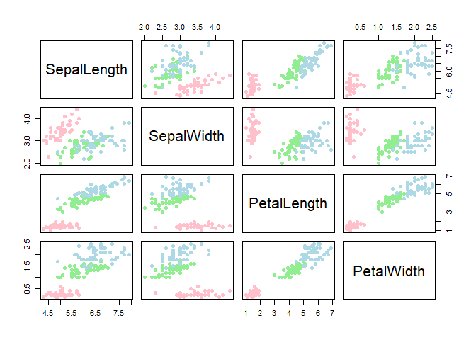<!-- -->

## 

Poboljšana verzija scatterplot matrice koja uključuje histograme i
koeficijente korelacije.

- koristimo naredbu <code>pairs.panels()</code> iz paketa psych

``` r
pairs.panels(iris[1:4], gap = 0, pch=21)
```

<!-- -->

## Oprez - Simpsonov paradox!

- fenomen u statistici u kojemu je povezanost dvije varijable u cijelom
  setu podataka (populacija) različita od povezanosti tih varijabli u
  sub-populacijama
- problem sa strukturiranim podatcima (i Irisi su takvi jer se u dataset
  nalaze podaci za 3 populacije tj. vrste irisa)

Kroz paket datasauRus se ilustrira situacija gdje korelacija na ukupnom
nivou ne odražava realne odnose unutar podgrupa.

``` r
library(datasauRus)
```

## Pokazni paket datasauRus

Svi datasetovi imaju slične deskriptivne statistike, ali očito mnogo
drugačiji izgled!

<!-- -->

## Detaljnije ćemo ispitati dataset *slant down*

``` r
dino<-datasaurus_dozen # učitavanje svih datasetova u objekt "dino"
slant_down<-dino[which(dino$dataset=="slant_down"),] # odabir dataset "slant_down"
ggplot(slant_down, aes(x = x, y = y)) + geom_point() # vizualizacija dataseta "slant_down"
```

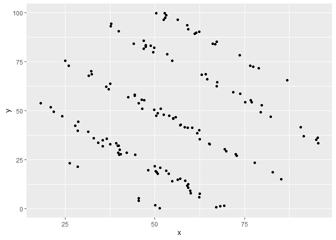<!-- -->

## Izračunajmo korelaciju i značajnost iz datasaet *slant down*

``` r
rcorr(slant_down$x,slant_down$y)
```

    ##       x     y
    ## x  1.00 -0.07
    ## y -0.07  1.00
    ## 
    ## n= 142 
    ## 
    ## 
    ## P
    ##   x      y     
    ## x        0.4147
    ## y 0.4147

- iako ispada da korelacije nema (p\>0.05), izgleda da su podatci
  strukturirani (više grupa), a korelacija unutar tih grupa se čini
  dosta jaka i negativna.

## 4. Kovarijanca

- Kovarijanca mjeri zajedničku varijaciju između parova numeričkih
  varijabli.
- Dalje sličnu informaciju kao korelacija, ali se računa na drugačiji
  način.
- Ključna je za PCA jer PCA koristi kovarijacijski matriks za
  određivanje glavnih komponenti.

``` r
cov(iris[,(1:4)])
```

    ##             SepalLength SepalWidth PetalLength PetalWidth
    ## SepalLength   0.6856935 -0.0424340   1.2743154  0.5162707
    ## SepalWidth   -0.0424340  0.1899794  -0.3296564 -0.1216394
    ## PetalLength   1.2743154 -0.3296564   3.1162779  1.2956094
    ## PetalWidth    0.5162707 -0.1216394   1.2956094  0.5810063

## 5. Principal Component Analysis (PCA)

- na hrv. **analiza glavnih komponenti**
- koristi se za smanjenje multidimenzioniranosti podataka i lakšu
  vizualizaciju u 2D prostoru

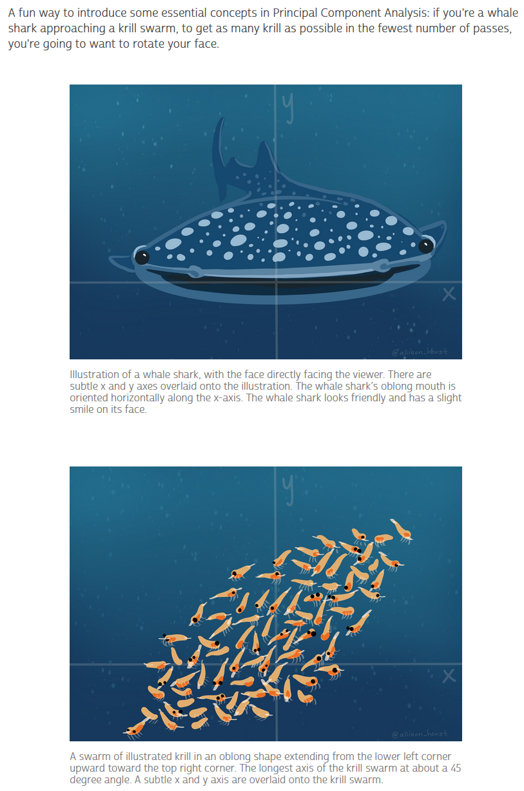<!-- -->

Slika preuzata s linka: <https://allisonhorst.com/everything-else>

- naredba <code>prcomp()</code> s opcijom <code>scale.=TRUE</code>
  standardizira podatke kako bi sve varijable imale jednak doprinos

``` r
pca_res <- prcomp(iris %>% select(SepalLength:PetalWidth), scale. = TRUE)
print(pca_res)
```

    ## Standard deviations (1, .., p=4):
    ## [1] 1.7083611 0.9560494 0.3830886 0.1439265
    ## 
    ## Rotation (n x k) = (4 x 4):
    ##                    PC1         PC2        PC3        PC4
    ## SepalLength  0.5210659 -0.37741762  0.7195664  0.2612863
    ## SepalWidth  -0.2693474 -0.92329566 -0.2443818 -0.1235096
    ## PetalLength  0.5804131 -0.02449161 -0.1421264 -0.8014492
    ## PetalWidth   0.5648565 -0.06694199 -0.6342727  0.5235971

- rezultat su *loadings* - korelacije izvornih varijabli sa glavnim
  komponentama (PC osi)

## Ukupno objašnjena varijanca svake PC osi

- dobiva se naredbom <code>summary()</code>

``` r
summary(pca_res)
```

    ## Importance of components:
    ##                           PC1    PC2     PC3     PC4
    ## Standard deviation     1.7084 0.9560 0.38309 0.14393
    ## Proportion of Variance 0.7296 0.2285 0.03669 0.00518
    ## Cumulative Proportion  0.7296 0.9581 0.99482 1.00000

## *Scree plot*

- prikazuje doprinos svake komponente ukupnoj varijanci

``` r
plot(pca_res)
```

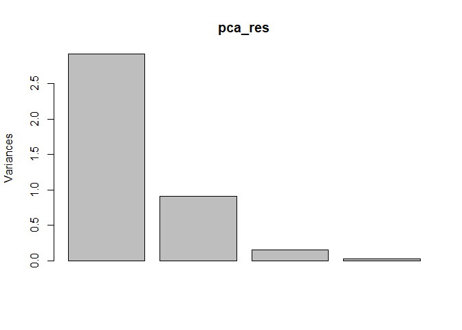<!-- -->

## Korelacije između glavnih komponenata (PC)

- u multi-dimenzionalnom prostoru, svaka PC os je okomita jedna na drugu
  te nema korelacijemeđu njima

``` r
pairs.panels(pca_res$x)
```

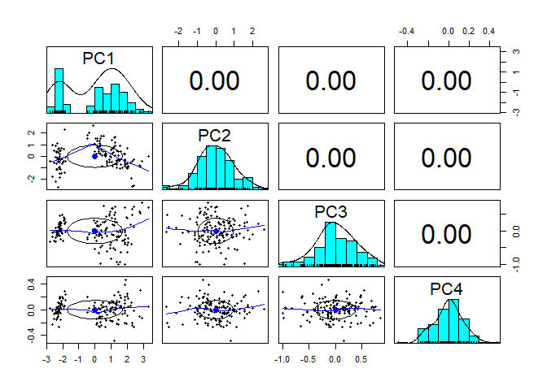<!-- -->

## Vizualizacija PCA

PCA scatterplot obojen prema vrstama irisa, s prikazom *loadings*
vektora

``` r
autoplot(pca_res, data = iris, colour = 'Species',
         loadings = TRUE, loadings.label = TRUE, loadings.label.size = 3)
```

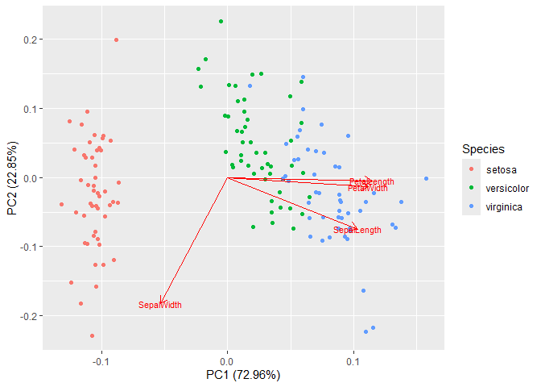<!-- -->

## Zadatak:

Odvojite dataset iris u 3 tablici, 1 za svaku vrstu i napravite PCA
analizu za svaku vrstu irisa.

Kakav je izled PCA grafa u odnosu na cijeli dataset?

## 6. Diskriminantna analiza (LDA)

- LDA je metoda klasifikacije koja maksimizira razlike između grupa.
- Predviđanje pripadnosti podatka nekoj grupi ne temelju ranije poznatih
  mjerenja

``` r
# izračunavanje linearne diskriminantne funkcije za odvajanje vrsta irisa
lda_res <- lda(Species ~ SepalLength + SepalWidth + PetalLength + PetalWidth, 
               data = iris)
```

## 

``` r
print(lda_res)
```

    ## Call:
    ## lda(Species ~ SepalLength + SepalWidth + PetalLength + PetalWidth, 
    ##     data = iris)
    ## 
    ## Prior probabilities of groups:
    ##     setosa versicolor  virginica 
    ##  0.3333333  0.3333333  0.3333333 
    ## 
    ## Group means:
    ##            SepalLength SepalWidth PetalLength PetalWidth
    ## setosa           5.006      3.428       1.462      0.246
    ## versicolor       5.936      2.770       4.260      1.326
    ## virginica        6.588      2.974       5.552      2.026
    ## 
    ## Coefficients of linear discriminants:
    ##                    LD1         LD2
    ## SepalLength  0.8293776 -0.02410215
    ## SepalWidth   1.5344731 -2.16452123
    ## PetalLength -2.2012117  0.93192121
    ## PetalWidth  -2.8104603 -2.83918785
    ## 
    ## Proportion of trace:
    ##    LD1    LD2 
    ## 0.9912 0.0088

------------------------------------------------------------------------

``` r
plot(lda_res)
```

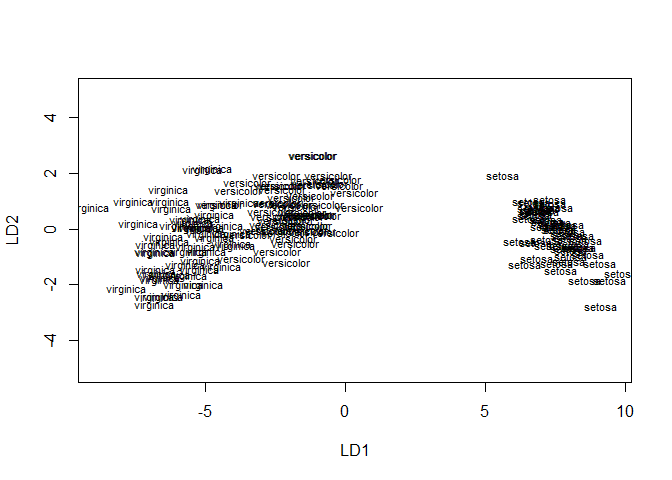<!-- -->

Ovaj plot je vrlo loš, služi samo za prvi pogled u rezultate analize!

## test “sortiranja”

- primjenimo dobivenu diskrim. funkciju ponovo na čitav dataset

``` r
lda_pred <- predict(lda_res)
```

- ovo su vjerojatnosti klasifikacije u grupu (samo prvih 6 jedinki -
  head)

``` r
head(lda_pred$posterior)
```

    ##   setosa   versicolor    virginica
    ## 1      1 3.896358e-22 2.611168e-42
    ## 2      1 7.217970e-18 5.042143e-37
    ## 3      1 1.463849e-19 4.675932e-39
    ## 4      1 1.268536e-16 3.566610e-35
    ## 5      1 1.637387e-22 1.082605e-42
    ## 6      1 3.883282e-21 4.566540e-40

## koliko ih je tocno sortirao

- pomoću naredbe <code>mean()</code> dobivamo postotak točno sortiranih
  vrsta (98%)
- u tablici napravljenoj pomoću naredbe <code>table()</code> možemo
  vidjeti koliko je koje vrste točno, a koliko krivo sortirano

``` r
mean(lda_pred$class==iris$Species)
```

    ## [1] 0.98

``` r
table(pred = lda_pred$class, true = iris$Species)
```

    ##             true
    ## pred         setosa versicolor virginica
    ##   setosa         50          0         0
    ##   versicolor      0         48         1
    ##   virginica       0          2        49

## Vizualizacija LDA - priprema

- u originalnu tablicu tj. objekt <code>iris</code> dodajemo vrijednosti
  LDA1 i LDA2 osi kako bi ih mogli grafički prikazati

``` r
iris$LDA1 <- lda_pred$x[,1]
iris$LDA2 <- lda_pred$x[,2]
head(iris)
```

    ##   SepalLength SepalWidth PetalLength PetalWidth Species     LDA1       LDA2
    ## 1         5.1        3.5         1.4        0.2  setosa 8.061800 -0.3004206
    ## 2         4.9        3.0         1.4        0.2  setosa 7.128688  0.7866604
    ## 3         4.7        3.2         1.3        0.2  setosa 7.489828  0.2653845
    ## 4         4.6        3.1         1.5        0.2  setosa 6.813201  0.6706311
    ## 5         5.0        3.6         1.4        0.2  setosa 8.132309 -0.5144625
    ## 6         5.4        3.9         1.7        0.4  setosa 7.701947 -1.4617210

## Vizualizacija LDA - ggplot

``` r
ggplot(iris, aes(x = LDA1, y = LDA2, color = Species)) +
  geom_point() + theme_minimal() +
  labs(title = "LDA Scatterplot", x = "LDA1", y = "LDA2")
```

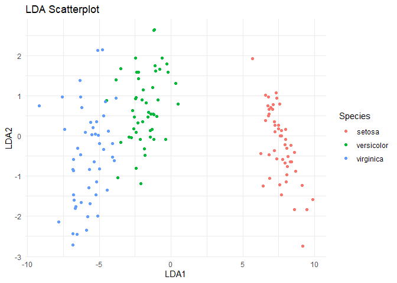<!-- -->

## Zadatak

Dodajte na graf “predviđene vrste” kao različite oblike točaka.

## Rješenje

``` r
ggplot(iris, aes(x = LDA1, y = LDA2, color = Species, shape = lda_pred$class)) +
  geom_point() +
  labs(title = "LDA Scatterplot", x = "LDA1", y = "LDA2") +
  theme_minimal()
```

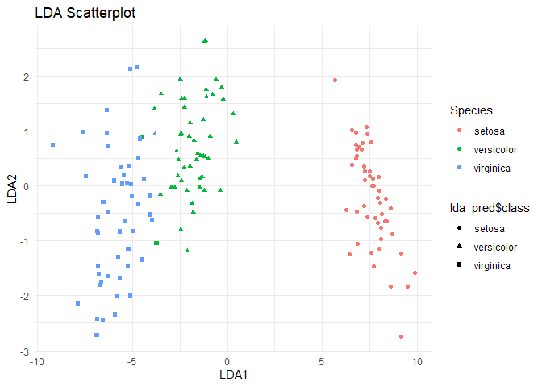<!-- -->

## 7. K-means klasteriranje

- za razliku od LDA analize gdje je unaprijed određeno u koliko grupa će
  se sortirati jedinke, u k-means klasteriranju se predviđa optimalni
  broj grupa (klastera) u jedom datasetu
- koristi se za setove podataka u kojima **ne znamo točan broj grupa**
  (irisi nisu najbolji primjer, ali je se mogu koristiti za provjeru
  rada metode)

``` r
# skaliramo podatke (svedemo ih sve na prosjek = 0 i sd = 1)
scaled_iris <- scale(iris[1:4],)
```

- slikovit prikaz metode na
  <https://allisonhorst.com/k-means-clustering>

## Određivanje vjerojatnog broja clustera

- napravi se k-means za raspon mogucih vrijednosti k
- za svaki k se zapamti vrijednost suma kvadrata unutar clustera -
  **wss** (*Within-Cluster Sum of Squares*)

``` r
set.seed(123)
k.max <- 10
wss <- sapply(1:k.max,
              function(k){kmeans(scaled_iris, k, nstart=50,iter.max = 15 )$tot.withinss})
wss
```

    ##  [1] 596.00000 220.87929 138.88836 113.33162  90.20190  79.46554  70.18758
    ##  [8]  62.05221  53.89983  46.81687

## Graf promjene **wss** sa porastom broja klastera - **k**

“koljeno” u ovom grafu - optimalan broj clustera

``` r
plot(1:k.max, wss,
     type="b", pch = 19, frame = FALSE,
     xlab="Broj clustera - K",
     ylab="Suma kvadrata unutar clustera")
```

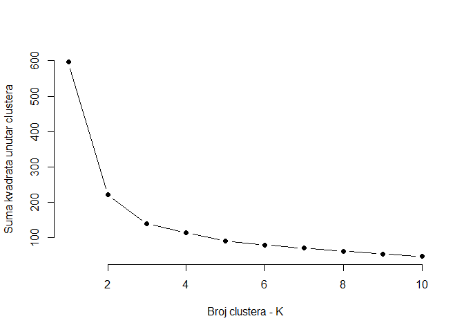<!-- -->

## “koljeno” je na 3 clustera

``` r
km<-kmeans(scaled_iris, centers=3, iter.max = 10, nstart = 1)
km
```

    ## K-means clustering with 3 clusters of sizes 50, 47, 53
    ## 
    ## Cluster means:
    ##   SepalLength  SepalWidth PetalLength PetalWidth
    ## 1 -1.01119138  0.85041372  -1.3006301 -1.2507035
    ## 2  1.13217737  0.08812645   0.9928284  1.0141287
    ## 3 -0.05005221 -0.88042696   0.3465767  0.2805873
    ## 
    ## Clustering vector:
    ##   [1] 1 1 1 1 1 1 1 1 1 1 1 1 1 1 1 1 1 1 1 1 1 1 1 1 1 1 1 1 1 1 1 1 1 1 1 1 1
    ##  [38] 1 1 1 1 1 1 1 1 1 1 1 1 1 2 2 2 3 3 3 2 3 3 3 3 3 3 3 3 2 3 3 3 3 2 3 3 3
    ##  [75] 3 2 2 2 3 3 3 3 3 3 3 2 2 3 3 3 3 3 3 3 3 3 3 3 3 3 2 3 2 2 2 2 3 2 2 2 2
    ## [112] 2 2 3 3 2 2 2 2 3 2 3 2 3 2 2 3 2 2 2 2 2 2 3 3 2 2 2 3 2 2 2 3 2 2 2 3 2
    ## [149] 2 3
    ## 
    ## Within cluster sum of squares by cluster:
    ## [1] 47.35062 47.45019 44.08754
    ##  (between_SS / total_SS =  76.7 %)
    ## 
    ## Available components:
    ## 
    ## [1] "cluster"      "centers"      "totss"        "withinss"     "tot.withinss"
    ## [6] "betweenss"    "size"         "iter"         "ifault"

## Pogledajmo koliko ima koje vrste u svakom clusteru

Prvo moramo dodati informaciju koja je jedinka svrstana u koji klaster
tako da iz objetka <code>km</code> zalijepimo vektor
<code>cluster</code> u objekt <code>iris</code>

``` r
iris_km <- cbind(iris, cluster = km$cluster)
head(iris_km)
```

    ##   SepalLength SepalWidth PetalLength PetalWidth Species     LDA1       LDA2
    ## 1         5.1        3.5         1.4        0.2  setosa 8.061800 -0.3004206
    ## 2         4.9        3.0         1.4        0.2  setosa 7.128688  0.7866604
    ## 3         4.7        3.2         1.3        0.2  setosa 7.489828  0.2653845
    ## 4         4.6        3.1         1.5        0.2  setosa 6.813201  0.6706311
    ## 5         5.0        3.6         1.4        0.2  setosa 8.132309 -0.5144625
    ## 6         5.4        3.9         1.7        0.4  setosa 7.701947 -1.4617210
    ##   cluster
    ## 1       1
    ## 2       1
    ## 3       1
    ## 4       1
    ## 5       1
    ## 6       1

## U tablici vidimo točno i netočno svrstane vrste u klastere

``` r
table(clust = iris_km$cluster, true = iris_km$Species)
```

    ##      true
    ## clust setosa versicolor virginica
    ##     1     50          0         0
    ##     2      0         11        36
    ##     3      0         39        14

## Grafički prikaz clustera - priprema

- da bi to mogli, moramo koristiti PCA rezultat
- prvo pretvorimo vektor cluster u iz integera u faktor (inače se ne
  prikazuju dobro boje)

``` r
str(iris_km)
```

    ## 'data.frame':    150 obs. of  8 variables:
    ##  $ SepalLength: num  5.1 4.9 4.7 4.6 5 5.4 4.6 5 4.4 4.9 ...
    ##  $ SepalWidth : num  3.5 3 3.2 3.1 3.6 3.9 3.4 3.4 2.9 3.1 ...
    ##  $ PetalLength: num  1.4 1.4 1.3 1.5 1.4 1.7 1.4 1.5 1.4 1.5 ...
    ##  $ PetalWidth : num  0.2 0.2 0.2 0.2 0.2 0.4 0.3 0.2 0.2 0.1 ...
    ##  $ Species    : Factor w/ 3 levels "setosa","versicolor",..: 1 1 1 1 1 1 1 1 1 1 ...
    ##  $ LDA1       : num  8.06 7.13 7.49 6.81 8.13 ...
    ##  $ LDA2       : num  -0.3 0.787 0.265 0.671 -0.514 ...
    ##  $ cluster    : int  1 1 1 1 1 1 1 1 1 1 ...

``` r
iris_km$cluster <- as.factor(iris_km$cluster)
```

## Grafički prikaz clustera

``` r
# bojamo po klasteru, oblik je po vrsti
autoplot(pca_res, data = iris_km, colour = 'cluster', shape = 'Species',
         loadings = TRUE, loadings.label = TRUE, loadings.label.size = 3)
```

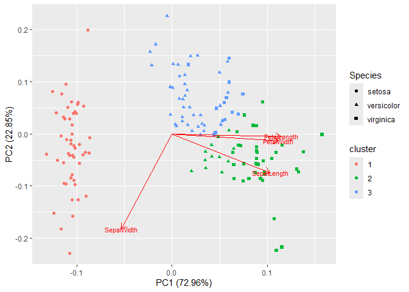<!-- -->

## Kviz

https://forms.cloud.microsoft/e/E8UNGzrGTU

<!-- -->

